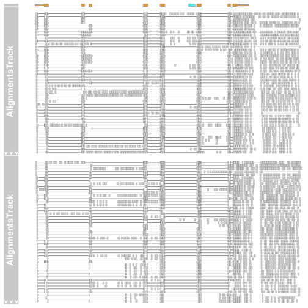
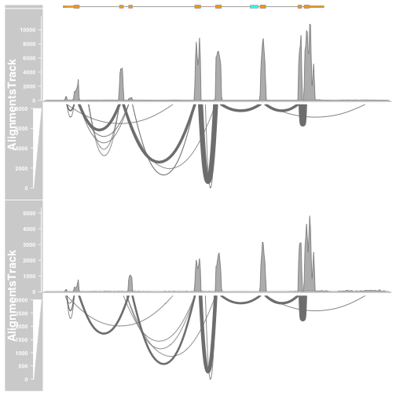

VisualisingGenomicsData
========================================================
author: MRC Clinical Sciences Centre
date: http://mrccsc.github.io/training.html
autosize: true

Intro slides
========================================================


Topics Covered
========================================================

* Visualising high dimensional data
  + Heatmap
  + Principal Component Analysis
* Meta signal of Genomic Intervals/Regions
  + Replicate peaks
  + Average Coverage
  + Motif occurence
* Exporting data to IGV
  + Tracktables
  + Exporting DESeq2 results to IGV
* Visualising features in Gviz
  + Introduction to Gviz.
  + Plotting coverage over regions.
  + Adding annotation.
  + Plotting reads
  + Plotting splice junctions.

Plotting Splice Junctions
========================================================


```
      /Users/tcarroll/Desktop/VisualisingGenomicsData/Data/heart.bodyMap.bam 
"/Users/tcarroll/Desktop/VisualisingGenomicsData/Data/heart.bodyMap.bam.bai" 
```

```
      /Users/tcarroll/Desktop/VisualisingGenomicsData/Data/liver.bodyMap.bam 
"/Users/tcarroll/Desktop/VisualisingGenomicsData/Data/liver.bodyMap.bam.bai" 
```




afrom <- 2960000
ato <- 3160000
alTrack <- AlignmentsTrack(system.file(package = "Gviz","extdata", "gapped.bam"), isPaired = TRUE)
bmt <- BiomartGeneRegionTrack(genome = "hg19", chromosome = "chr12",
start = afrom, end = ato, filter = list(with_ox_refseq_mrna = TRUE),stacking = "dense")
plotTracks(c(bmt, alTrack),
           chromosome = "chr12", type = c("coverage","sashimi"))
           
alTrack <- AlignmentsTrack("~/Desktop/VisualisingGenomicsData/Data/heart.bodyMap.bam", isPaired = TRUE)

           
library(GenomicRanges)
data(cpgIslands)
class(cpgIslands)
chr <- as.character(unique(seqnames(cpgIslands)))
gen <- genome(cpgIslands)
atrack <- AnnotationTrack(cpgIslands, name = "CpG")
plotTracks(atrack)


data(geneModels)
grtrack <- GeneRegionTrack(geneModels, genome = gen,chromosome = chr, name = "Gene Model")
plotTracks(list(grtrack))

