Visualising Genomics Data
========================================================
author: MRC Clinical Sciences Centre
date: http://mrccsc.github.io/training.html
autosize: true
author: "MRC CSC Bioinformatics Core Team"
date:http://mrccsc.github.io/training.html
width: 1440
height: 1100
autosize: true
font-import: <link href='http://fonts.googleapis.com/css?family=Slabo+27px' rel='stylesheet' type='text/css'>
font-family: 'Slabo 27px', serif;
css:style.css


The course
========================================================

* Where to find more information.
* [ChIP-seq file types covered](#/filetypes).
* [Story so far](#/background).
* [Materials](#/materials).
* [Assessing ChIP-seq quality](#/qc).
* [Working with peaks](#/peakpushing).
* [Functional annotation of peaks](#/functional).
* [Denovo motifs](#/motifs).
* [Getting hold of external data](#/external).
* [Exporting data for visualisation](#/viz).

Some extra work -
* [Complex Overlaps](#/complexOverlaps).
* [Differential ChIP-seq](#/diffchip).


Importance of Visualising Genomics Data.
========================================================
id: vizdata

It is an essential step in genomics data analysis to visualise your data. This allows you to review data for both potential sources of data patterns and analysis artefacts.

While we have discussed using IGV to review genomics data, now we will discuss how to do this while still working with in the R.

Visualising Genomics Data in R/Bioconductor.
========================================================
id: vizdataR

This set of material will concentrate on using the Bioconductor [**Gviz**](https://bioconductor.org/packages/release/bioc/html/Gviz.html) package to visualise genomic feature of interest.

In complement to our IGV genome browser course where we reviewed visualising genomics data in a browser, here we will use R/Bioconductor to produce publication quality graphics programatically. 

Reminder of file types
========================================================
id: filetypes

In this session we will be dealing with a range of data types. For more information on file types you can revisit our material.

* [File Formats](http://mrccsc.github.io/genomicFormats.html).

For more information on visualising genomics data in browsers you can visit our IGV course.

* [IGV](http://mrccsc.github.io/IGV_course/).

Reminder of data types in Bioconductor
========================================================
id: datatypes

We will also encounter and make use of many data structures and data types which we have encountered throughout our courses on HTS data. You can revisit this material to refresh on HTS data analysis in Bioconductor and R

* [Bioconductor](http://mrccsc.github.io/Bioconductor/).
* [Alignments](https://mrccsc.github.io/Alignment/).
* [ChIP-seq](http://mrccsc.github.io/ChIPseq_short/).
* [RNA-seq](http://mrccsc.github.io/RNAseq_short/).


Materials.
========================================================
id: materials

All material for this course can be found on github.
* [Visualising Genomics Data](https://github.com/mrccsc/VisualisingGenomicsData)

Or can be downloaded as a zip archive from here. 
* [Download zip](https://github.com/mrccsc/VisualisingGenomicsData/archive/master.zip)

Materials. - Presentations, source code and practicals.
========================================================

Once the zip file in unarchived. All presentations as HTML slides and pages, their R code and HTML practical sheets will be available in the directories underneath.

* **presentations/slides/**
Presentations as an HTML slide show.
* **presentations/singlepage/** 
Presentations as an HTML single page.
* **presentations/rcode/**
R code in presentations.
* **presentations/practicals/**
Practicals as an HTML page. 

Materials. - Data for presentations, practicals.
========================================================

All data to run code in the presentations and in the practicals is available in the zip archive. This includes coverage as bigWig files, aligned reads as BAM files and genomic intervals stored as BED files

All data can be found under the **Data** directory

**Data/**


We also include some RData files containing precompiled results from querying database (in case of external server downtime). All RData files can be found in the RData directory

**RData/**

Set the Working directory
========================================================

Before running any of the code in the practicals or slides we need to set the working directory to the folder we unarchived. 

You may navigate to the unarchived VisualisingGenomicsData folder in the Rstudio menu

**Session -> Set Working Directory -> Choose Directory**

or in the console.


```r
setwd("/PathToMyDownload/VisualisingGenomicsData/")
# e.g. setwd("~/Downloads/VisualisingGenomicsData")
```


Visualising Genomics Data around Genomic Features
========================================================

Genomics data can often be visualised in genome browsers such as the user friendly IGV genome browser.

This allows for the visualisation of our processed data in a specific genomic context.

In genomics it is important to review our data/results and hypotheses in a browser to identify patterns or potential artefacts missed within our analysis.

Visualising Genomics Data around Genomic Features in IGV
========================================================

We have already discussed on using the IGV browser to review our data and get access to online data repositories.

IGV is quick, user friendly GUI to perform the essential task of genomics data review.

For more information see our course on IGV [here](http://mrccsc.github.io/IGV_course/).


Visualising Genomics Data around Genomic Features in R
========================================================

Using a genome browser to review sites of interest across the genome is a critical first step.

Using indexed files, IGV offers an method to rapidly interrogate genomics data along the linear genome.

However, as with any GUI, IGV does not offer the flexibility in displaying data we wish to achieve and to review large number of sites demands significant user input or creation of IGV batch scripts.

Visualising Genomics Data around Genomic Features in R (Gviz)
========================================================

The Gviz packages offers methods to produce publication quality plots of genomics data at genomic features of interest.


To get started using Gviz in some biological examples, first we need to install the package.


```r
## try http:// if https:// URLs are not supported
source("https://bioconductor.org/biocLite.R")
biocLite("Gviz")
```


Getting started with Gviz -- Linear genome axis.
========================================================
id: genomeaxis

Gviz provides methods to plot many genomics data types (as with IGV) over genomic features and genomic annotation within a linear genomic reference.


The first thing we can do then is set up our linear axis representing positions on genomes.

For this we use our first method from Gviz **GenomeAxisTrack()**.
Here we use the **name** parameter to set the name to be "myAxis".


```r
library(Gviz)
genomeAxis <- GenomeAxisTrack(name="MyAxis")
genomeAxis
```

```
Genome axis 'MyAxis'
```

Getting started with Gviz -- Plotting the axis
========================================================

Now we have created a **GenomeAxisTrack** track object we can display the object using **plotTracks** function.

In order to display a axis track we need to set the limits of the plot *(otherwise where would it start and end?)*.


```r
plotTracks(genomeAxis,from=100,to=10100)
```

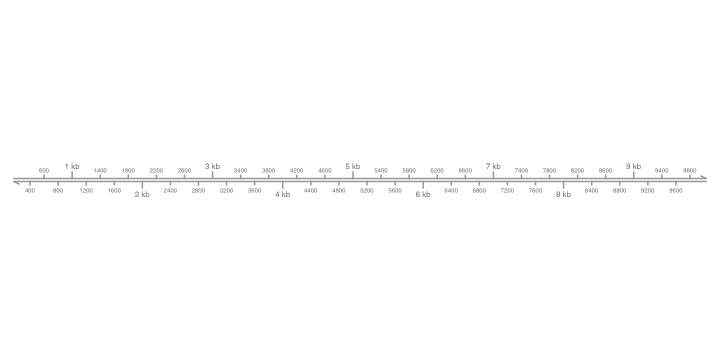


Getting started with Gviz -- Configuring the axis (part-1)
========================================================

It is fairly straightforward to create and render this axis.
Gviz offers a high degree of flexibility in the way these tracks can be plotted with some very useful plotting configurations included.

A useful feature is to add some information on the direction of the linear genome represented in this **GenomeAxisTrack**.

We can add labels for the 5' to 3' direction for the positive and negative strand by using the **add53** and **add35** parameters.


```r
plotTracks(genomeAxis,from=100,to=10100,
           add53=T,add35=T)
```

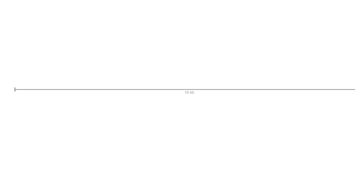

Getting started with Gviz -- Configuring the axis (part-2)
========================================================

We can also configure the resolution of the axis (albeit rather bluntly) using the **littleTicks** parameter.

This will add additional axis tick marks between those shown by default.


```r
plotTracks(genomeAxis,from=100,to=10100,
           littleTicks = TRUE)
```

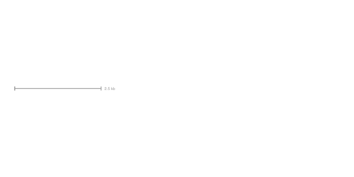

Getting started with Gviz -- Configuring the axis (part-3)
========================================================

By default the plot labels for the genome axis track are alternating below and above the line.

We can further configure the axis labels using the **labelPos** parameter.

Here we set the labelPos to be always below the axis


```r
plotTracks(genomeAxis,from=100,to=10100,
           labelPos="below")
```


Getting started with Gviz -- Configuring the axis (part-4)
========================================================

In the previous plots we have produced a genomic axis which allows us to consider the position of the features within the linear genome.

In some contexts we may be more interested in relative distances around and between the genomic features being displayed.

We can configure the axis track to give us a relative representative of distance using the **scale** parameter.


```r
plotTracks(genomeAxis,from=100,to=10100,
           scale=1,labelPos="below")
```

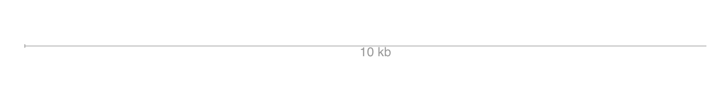
Getting started with Gviz -- Configuring the axis (part-4b)
========================================================

We may want to add only a part of the scale (such as with Google Maps) to allow the reviewer to get a sense of distance.

We can specify how much of the total axis we wish to display as a scale using a value of 0 to 1 representing the proportion of scale to show.


```r
plotTracks(genomeAxis,from=100,to=10100,
           scale=0.3)
```

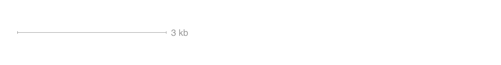

Getting started with Gviz -- Configuring the axis (part-4c)
========================================================

We can also provide numbers greater than 1 to the **scale** parameter which will determine, in absolute base pairs, the size of scale to display.


```r
plotTracks(genomeAxis,from=100,to=10100,
           scale=2500)
```

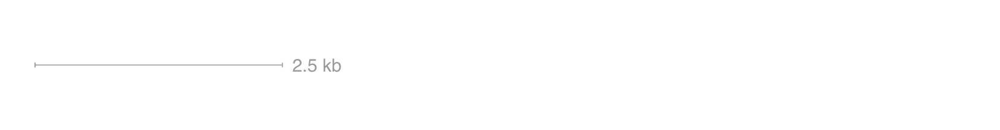


Getting started with Gviz -- Axis and Regions of Interest (part-1)
========================================================

Previously we have seen how to highlight regions of interest in the scale bar for IGV.

These "regions of interest" may be user defined locations which add context to the scale and the genomics data to be displayed (e.g. Domain boundaries such as topilogically associated domains)

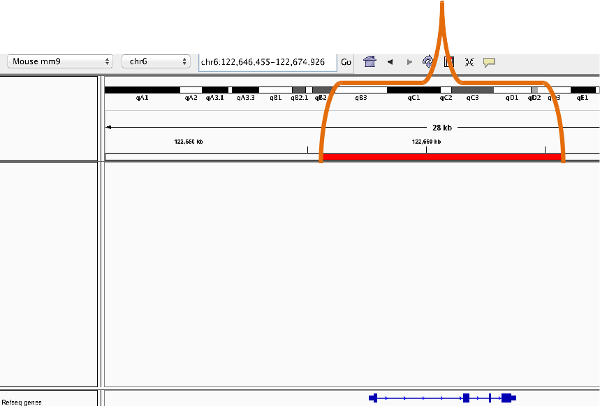


Getting started with Gviz -- Axis and Regions of Interest (part-2)
========================================================

We can add "regions of interest" to the axis plotted by Gviz as we have done with IGV.

To do this we will need to define some ranges to signify the positions of "regions of interest" in the linear context of our genome track.

Since the plots have no apparent context for chromosomes (yet), we will use a IRanges object to specify "regions of interest" as opposed to the genome focused GRanges.

You can see our material [here](http://mrccsc.github.io/Bioconductor/) on Bioconductor objects for more information on IRanges and GRanges.

Brief recap (Creating an IRanges)
========================================================

To create an IRanges object we will load the IRanges library and specify vectors of **start** and **end** parameters to the **IRanges** constructor function.


```r
library(IRanges)
regionsOfInterest <- IRanges(start=c(140,5140),end=c(2540,7540))
names(regionsOfInterest) <- c("ROI_1","ROI_2")
regionsOfInterest
```

```
IRanges object with 2 ranges and 0 metadata columns:
            start       end     width
        <integer> <integer> <integer>
  ROI_1       140      2540      2401
  ROI_2      5140      7540      2401
```

Getting started with Gviz -- Axis and Regions of Interest (part-3)
========================================================

Now we have our IRanges object representing our regions of interest we can include them in our axis.

We will have to recreate our axis track to allow us to include these regions of interest.

Once we have updated our GenomeAxisTrack object we can plot the axis with regions of interest included.


```r
genomeAxis <- GenomeAxisTrack(name="MyAxis",
                              range = regionsOfInterest)
plotTracks(genomeAxis,from=100,to=10100)
```

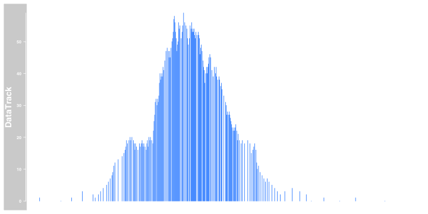

Getting started with Gviz -- Axis and Regions of Interest (part-4)
========================================================

We include the names specified in the IRanges for the regions of interest within the axis plot by specify the **showID** parameter to TRUE.


```r
plotTracks(genomeAxis,from=100,to=10100,
           range=regionsOfInterest,
           showId=T)
```


Plotting regions in Gviz - Data tracks
========================================================

Now we have some fine control of the axis, it follows that we may want some to display some actual data along side our axis and/or regions of interest.

Gviz contains a general container for data tracks which can be created using the **DataTrack()** constructor function and associated object, **DataTrack**.

Generally DataTrack may be used to display all data types with some work but best fits ranges with associated signal as a matrix (multiple regions) or vector (single sample).

Lets update our IRanges object to have some score columns in the metadata columns. We can do this with the **mcols** function as shown in our Bioconductor material.


```r
mcols(regionsOfInterest) <- data.frame(Sample1=c(30,20),Sample2=c(20,200))
regionsOfInterest <- GRanges(seqnames="chr5",ranges = regionsOfInterest)
```


Plotting regions in Gviz - Data tracks
========================================================

Now we have the data we need, we can create a simple **DataTrack** object.


```r
dataROI <- DataTrack(regionsOfInterest)
plotTracks(dataROI)
```

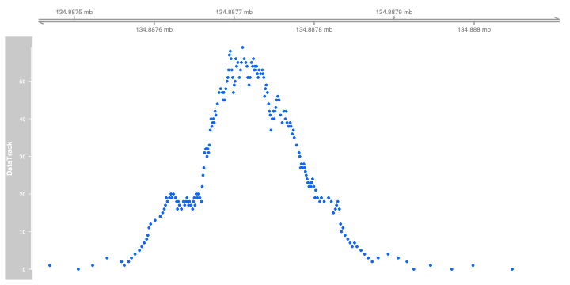

Plotting regions in Gviz - Data tracks
========================================================

As we have seen, **DataTrack** objects make use of IRanges/GRanges which are the central workhorse of Bioconductors HTS tools.

This means we can take advantage of the many manipulations available in the Bioconductor tool set.

Lets make use of rtracklayer's importing tools to retrieve coverage from a bigWig as a GRanges object


```r
library(rtracklayer)
allChromosomeCoverage <- import.bw("Data/small_Sorted_SRR568129.bw",as="GRanges")
allChromosomeCoverage
```

```
GRanges object with 249 ranges and 1 metadata column:
        seqnames         ranges strand |     score
           <Rle>      <IRanges>  <Rle> | <numeric>
    [1]     chrM [1,     16571]      * |         0
    [2]     chr1 [1, 249250621]      * |         0
    [3]     chr2 [1, 243199373]      * |         0
    [4]     chr3 [1, 198022430]      * |         0
    [5]     chr4 [1, 191154276]      * |         0
    ...      ...            ...    ... .       ...
  [245]    chr20 [1,  63025520]      * |         0
  [246]    chr21 [1,  48129895]      * |         0
  [247]    chr22 [1,  51304566]      * |         0
  [248]     chrX [1, 155270560]      * |         0
  [249]     chrY [1,  59373566]      * |         0
  -------
  seqinfo: 25 sequences from an unspecified genome
```


Plotting regions in Gviz - Data tracks (part 4)
========================================================

Now we have our coverage as a GRanges object we can create our DataTrack object from this.

Notice we specify the chromsome of interest in the **chromosome** parameter.


```r
accDT <- DataTrack(allChromosomeCoverage,chomosome="chr5")
accDT
```

```
DataTrack 'DataTrack'
| genome: NA
| active chromosome: chrM
| positions: 1
| samples:1
| strand: *
There are 248 additional annotation features on 24 further chromosomes
  chr1: 1
  chr10: 1
  chr11: 1
  chr12: 1
  chr13: 1
  ...
  chr7: 1
  chr8: 1
  chr9: 1
  chrX: 1
  chrY: 1
Call seqlevels(obj) to list all available chromosomes or seqinfo(obj) for more detailed output
Call chromosome(obj) <- 'chrId' to change the active chromosome 
```


Plotting regions in Gviz - Data tracks (part 5)
========================================================

To plot data now using the plotTracks() function we will set the regions we wish to plot by specifying the chromsomes, start and end using the **chromosome**, **from** and **to** parameters.

By default we will get a similar point plot to that seen before.


```r
plotTracks(accDT,
           from=134887451,to=134888111,
           chromosome="chr5")
```

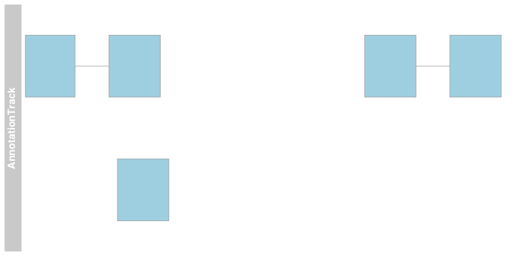


Plotting regions in Gviz - Data tracks (part 6)
========================================================

We can adjust the type of plots we want using the **type** argument.
Here as with standard plotting we can specify **"l"** to get a line plot.


```r
plotTracks(accDT,
           from=134887451,to=134888111,
           chromosome="chr5",type="l")
```

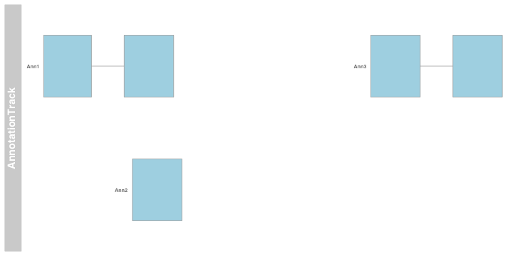


Plotting regions in Gviz - Data tracks (part 6)
========================================================
Many other types of plots are available for the DataTracks.

Including smoothed plots using "smooth".


```r
plotTracks(accDT,
           from=134887451,to=134888111,
           chromosome="chr5",type="smooth")
```

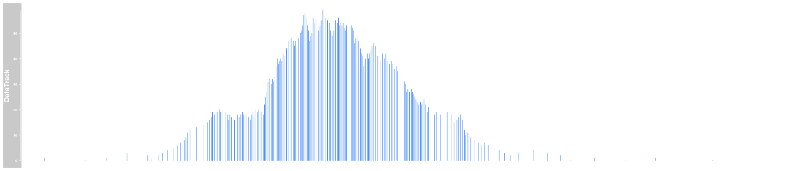


Plotting regions in Gviz - Data tracks (part 7)
========================================================

Histograms by specifying "h".


```r
plotTracks(accDT,
           from=134887451,to=134888111,
           chromosome="chr5",type="h")
```

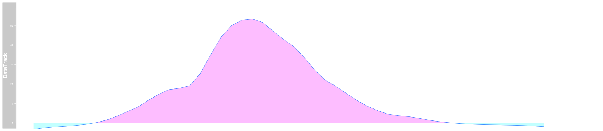

Plotting regions in Gviz - Data tracks (part 8)
========================================================
Or filled/smoothed plots using "mountain".


```r
plotTracks(accDT,
           from=134887451,to=134888111,
           chromosome="chr5",type="mountain")
```

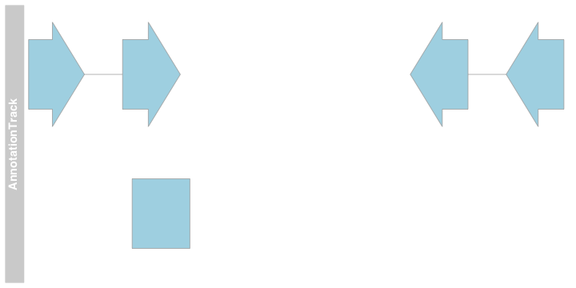


Plotting regions in Gviz - Data tracks (part 9)
========================================================

and even a Heatmap using "heatmap".

Notice that Gviz will automatically produce the appropriate Heatmap scale.


```r
plotTracks(accDT,
           from=134887451,to=134888111,
           chromosome="chr5",type="heatmap")
```


Plotting regions in Gviz - Additional Parameters.
========================================================

As with all plotting functions in R, Gviz plots are highly customisable.

Simple features such as point size and colour are easily set as for standard R plots using **sex** and **col** paramters.


```r
plotTracks(accDT,
           from=134887451,to=134888111,
           chromosome="chr5",
           col="red",cex=4)
```

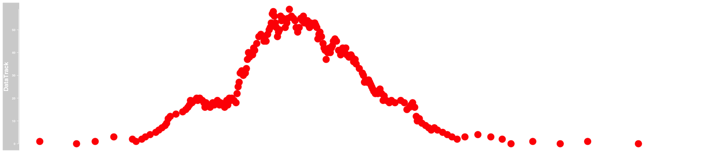


Putting track togethers - Axis and Data
========================================================

Now we have shown how to construct a data track and axis track we can put them together in one plot.

To do this we simply provide the GenomeAxisTrack and DataTrack objects as vector the **plotTracks()** function.


```r
plotTracks(c(accDT,genomeAxis),
           from=134887451,to=134888111,
           chromosome="chr5"
           )
```

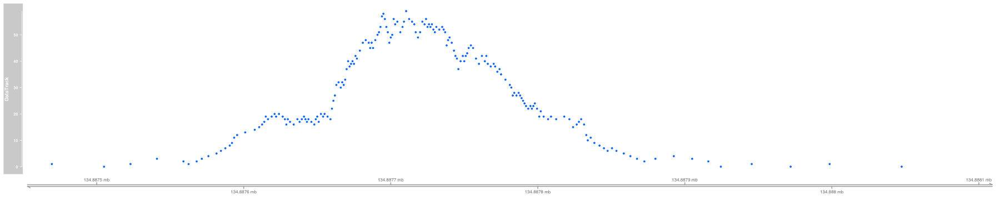

Putting track togethers - Ordering tracks in plot
========================================================

The order of tracks in the plot is simply defines by the order they are placed in the vector passed to **plotTracks()**


```r
plotTracks(c(genomeAxis,accDT),
           from=134887451,to=134888111,
           chromosome="chr5"
           )
```

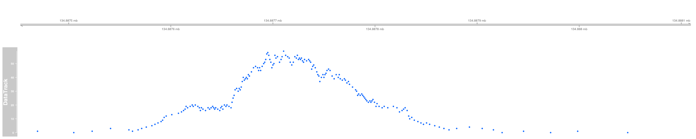

Putting track togethers - Controling height of tracks in plot
========================================================

By default, Gviz will try and provide sensible track heights for your plots to best display your data.

The track height can be controlled by provided a vector of relative heights to the **sizes** paramter of the **plotTracks()** function.

If we want the axis to be 50% of the height of the Data track we specify the size for axis as 0.5 and that of data as 1.
The order of sizes must match the order of objects they relate to.


```r
plotTracks(c(genomeAxis,accDT),
           from=134887451,to=134888111,
           chromosome="chr5",
           sizes=c(0.5,1)
           )
```


Exercises
========================================================


Adding annotation to plots.
========================================================

Genomic annotation, such as Gene/Transcript models, play an important part of visualising genomics data in context.

Gviz provides many routes for constructing genomic annotation using the **AnnotationTrack()** constructor function. In contrast to the **DataTrack**, **AnnotationTrack** allows for the specification of feature groups.

First lets create a GRanges object with some more regions


```r
toGroup <- GRanges(seqnames="chr5",
        IRanges(
          start=c(10,500,550,2000,2500),
          end=c(300,800,850,2300,2800)
        ))
names(toGroup) <- seq(1,5)

toGroup
```

```
GRanges object with 5 ranges and 0 metadata columns:
    seqnames       ranges strand
       <Rle>    <IRanges>  <Rle>
  1     chr5 [  10,  300]      *
  2     chr5 [ 500,  800]      *
  3     chr5 [ 550,  850]      *
  4     chr5 [2000, 2300]      *
  5     chr5 [2500, 2800]      *
  -------
  seqinfo: 1 sequence from an unspecified genome; no seqlengths
```

Adding annotation to plots. Grouping (part-1)
========================================================

Now we can create the **AnnotationTrack** object using the constructor.

Here we also provide a grouping to the **group** parameter in the **AnnotationTrack()** function.


```r
annoT <- AnnotationTrack(toGroup,
                group = c("Ann1",
                          "Ann1",
                          "Ann2",
                          "Ann3",
                          "Ann3"))

plotTracks(annoT)
```

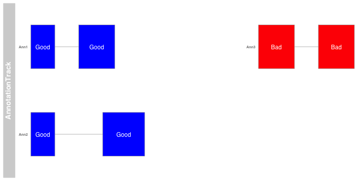


Adding annotation to plots.
========================================================

We can see we have got the features grouped by lines.

But if we want to see the names we must specify the group parameter by  using the **groupAnnotation** argument.


```r
plotTracks(annoT,groupAnnotation = "group")
```

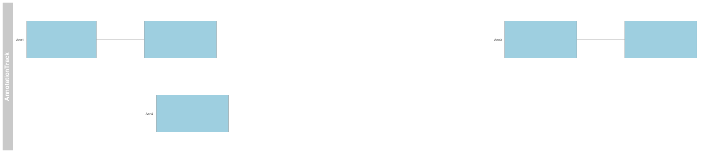

Adding annotation to plots. Grouping (part-2)
========================================================

We can see we have got the samples grouped by lines.

But if we want to see the names we must specify the group parameter used using the **groupAnnotation** argument.


```r
plotTracks(annoT,groupAnnotation = "group")
```

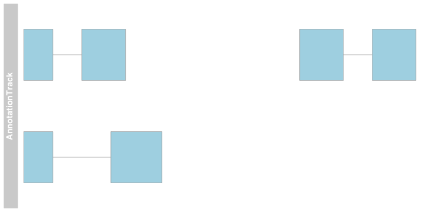

Adding annotation to plots. Strands and direction.
========================================================

When we created the GRanges used here we did not specify any strand information.


```r
strand(toGroup)
```

```
factor-Rle of length 5 with 1 run
  Lengths: 5
  Values : *
Levels(3): + - *
```

When plotting annotation without strand a box is used to display features as seen in previous slides

Adding annotation to plots. Strands and direction (part-2).
========================================================

Now we can specify some strand information for the GRanges and replot.

Arrows now indicate the strand which the features are on.


```r
strand(toGroup) <- c("+","+","*","-","-")
annoT <- AnnotationTrack(toGroup,
                group = c("Ann1",
                          "Ann1",
                          "Ann2",
                          "Ann3",
                          "Ann3"))

plotTracks(annoT, groupingAnnotation="group")
```


Adding annotation to plots. Controlling the display density
========================================================

In the IGV course we saw how you could control the display density of certain tracks. 

Annotation tracks are often stored in files such as the general feature format (see our previous course). 

IGV allows us to control the density of these tracks in the view options by setting to "collapsed", "expanded" or "squished".

Whereas "squished" and "expanded" maintains much of the information within the tracks, "collapsed" flattens overlapping features into a single displayed feature.


Adding annotation to plots. Controlling the display density (part 2)
========================================================

In Gviz we have the same control over the display density of our annotation tracks.

By default the tracks are stacked using the "squish" option to make best use of the available space.


```r
plotTracks(annoT, groupingAnnotation="group",stacking="squish")
```

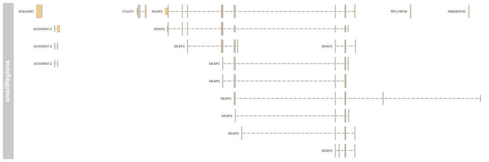


Adding annotation to plots. Controlling the display density (part 3)
========================================================

By setting the **stacking** parameter to "dense", all overlapping features have been collapsed/flattened


```r
plotTracks(annoT, groupingAnnotation="group",stacking="dense")
```


Adding annotation to plots. Feature types.
========================================================

**AnnotationTrack** objects may also hold information on feature types.

For gene models we may be use to feature types such as mRNA, rRNA, snoRNA etc.

Here we can make use of feature types as well.

We can set any feature types within our data using the **feature()** function. Here they are unset so displayed as unknown.


```r
feature(annoT)
```

```
[1] "unknown" "unknown" "unknown" "unknown" "unknown" "unknown"
```

Adding annotation to plots. Setting feature types.
========================================================

We can set our own feature types for the **AnnotationTrack** object using the same **feature()** function.

We can choose any feature types we wish to define.


```r
feature(annoT) <- c(rep("Good",4),rep("Bad",2))
feature(annoT)
```

```
[1] "Good" "Good" "Good" "Good" "Bad"  "Bad" 
```

Adding annotation to plots. Display feature types.
========================================================

Now we have defined our feature types we can use this information within our plots.

In GViz, we can directly specify attributes for individual feature types within our AnnotationTrack, in this example we add attributes for colour to be displayed.

We specify the "Good" features as blue and the "Bad" features as red.


```r
plotTracks(annoT, featureAnnotation = "feature",
           groupAnnotation = "group",
           Good="Blue",Bad="Red")
```

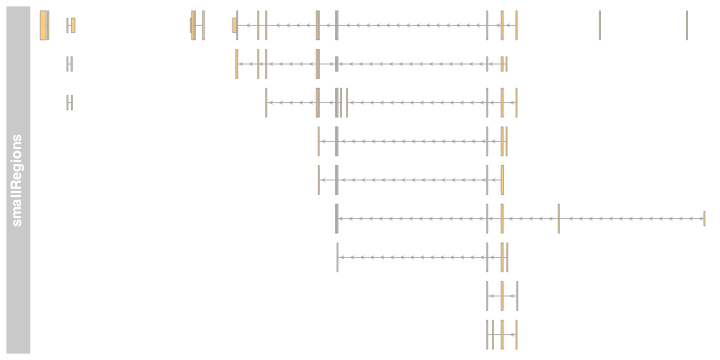


GeneRegionTrack
========================================================

We have seen how we can display complex annotation using the **AnnotationTrack** objects.

For gene models Gviz contains a more specialised object, the **GeneRegionTrack** object.

The **GeneRegionTrack** object contains additional parameters and display options specific for the display of gene models.

Lets start by looking at the small gene model set stored in the Gviz package.


```r
data(geneModels)
head(geneModels)
```

```
  chromosome    start      end width strand feature            gene
1       chr7 26591441 26591829   389      + lincRNA ENSG00000233760
2       chr7 26591458 26591829   372      + lincRNA ENSG00000233760
3       chr7 26591515 26591829   315      + lincRNA ENSG00000233760
4       chr7 26594428 26594538   111      + lincRNA ENSG00000233760
5       chr7 26594428 26596819  2392      + lincRNA ENSG00000233760
6       chr7 26594641 26594733    93      + lincRNA ENSG00000233760
             exon      transcript     symbol
1 ENSE00001693369 ENST00000420912 AC004947.2
2 ENSE00001596777 ENST00000457000 AC004947.2
3 ENSE00001601658 ENST00000430426 AC004947.2
4 ENSE00001792454 ENST00000457000 AC004947.2
5 ENSE00001618328 ENST00000420912 AC004947.2
6 ENSE00001716169 ENST00000457000 AC004947.2
```

GeneRegionTrack
========================================================


```
  chromosome    start      end width strand feature            gene
1       chr7 26591441 26591829   389      + lincRNA ENSG00000233760
2       chr7 26591458 26591829   372      + lincRNA ENSG00000233760
3       chr7 26591515 26591829   315      + lincRNA ENSG00000233760
4       chr7 26594428 26594538   111      + lincRNA ENSG00000233760
5       chr7 26594428 26596819  2392      + lincRNA ENSG00000233760
6       chr7 26594641 26594733    93      + lincRNA ENSG00000233760
             exon      transcript     symbol
1 ENSE00001693369 ENST00000420912 AC004947.2
2 ENSE00001596777 ENST00000457000 AC004947.2
3 ENSE00001601658 ENST00000430426 AC004947.2
4 ENSE00001792454 ENST00000457000 AC004947.2
5 ENSE00001618328 ENST00000420912 AC004947.2
6 ENSE00001716169 ENST00000457000 AC004947.2
```

We can see that this data.frame contains information on start, end , chromosome and strand of feature needed to position features in a linear genome.

Also included are a feature type column named "feature" and columns containing additional metadata to group by - "gene","exon","transcript","symbol".


GeneRegionTrack - Setting up the gene model track.
========================================================

We can define a GeneRegionTrack as we would all other tracktypes. Here we provide a genome name, chromosome of interest and a name for the track.


```r
grtrack <- GeneRegionTrack(geneModels, genome = "hg19",
                           chromosome = "chr7",
                           name = "smallRegions")
plotTracks(grtrack)
```


GeneRegionTrack - Setting up the gene model track.
========================================================


```r
plotTracks(grtrack)
```

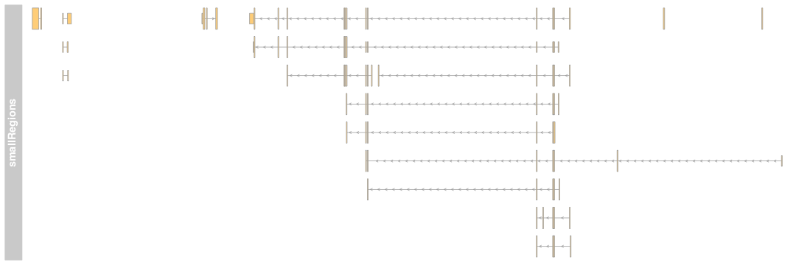

We can see that features here are rendered slightly differently to those in an **AnnotationTrack** object.

Here direction is illustrated by arrows in introns and unstranslated regions are shown as narrower boxes.


GeneRegionTrack - Specialised labelling.
========================================================

Since gene models typically contain exon, transcript and gene level annotation we can specify how we wish to annotate our plots by using the **transcriptAnnotation** and **exonAnnotation** parameters.

To label all transcripts by the gene annotation we specify the gene column to the **transcriptAnnotation** parameter.


```r
plotTracks(grtrack,transcriptAnnotation="gene")
```

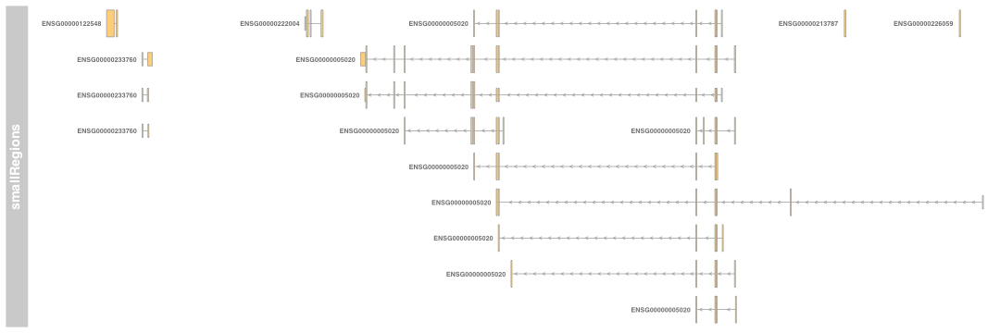

GeneRegionTrack - Specialised labelling.
========================================================

Similarly we can label transcripts by thier individual transcript names.


```r
plotTracks(grtrack,transcriptAnnotation="transcript")
```

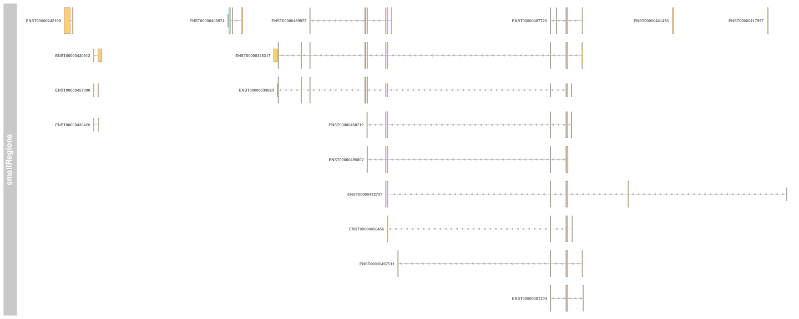

GeneRegionTrack - Specialised labelling.
========================================================

Or we can label using the **transcriptAnnotation** object by any arbitary column where there is, at maximum, one level per transcript.


```r
plotTracks(grtrack,transcriptAnnotation="symbol")
```


GeneRegionTrack - Specialised labelling of exons.
========================================================

As with transcripts we can label individual features using the **exonAnnotation** parameter by any arbitary column where there is one level per feature/exon.


```r
plotTracks(grtrack,exonAnnotation="exon",from=26677490,to=26686889,cex=0.5)
```

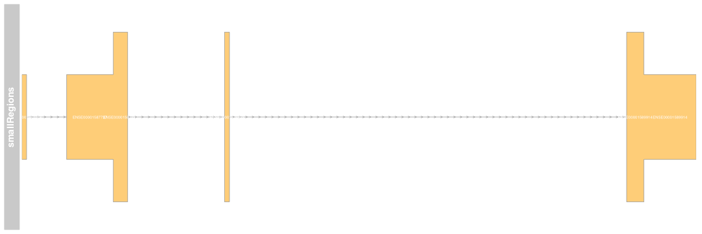

GeneRegionTrack - Specialized display density for gene models.
========================================================

We saw that we can control the display density when plotting **AnnotationTrack** objects.

We can control the display density of GeneRegionTracks in the same manner.


```r
plotTracks(grtrack, stacking="dense")
```

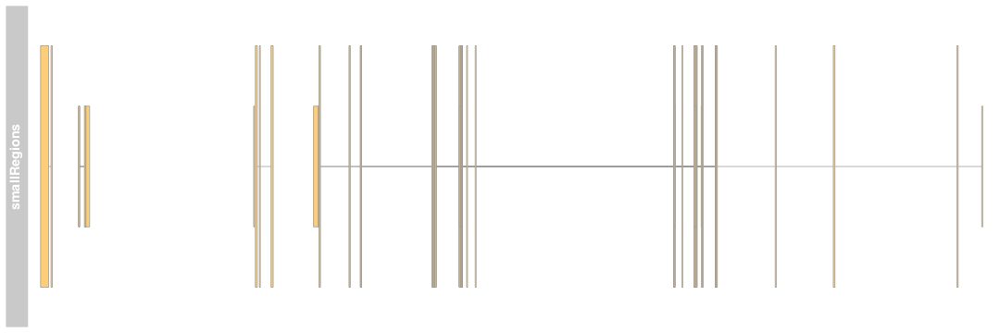

GeneRegionTrack - Specialized display density for gene models.
========================================================

However, since the **GeneRegionTrack** object is a special class of the **AnnotationTrack** object we have special parameter for dealing with display density of transcripts.

The **collapseTranscript** parameter allows us a finer degree of control than that seen with **stacking** parameter.

Here we set **collapseTranscript** to be true inorder to merge all overlapping transcripts. 


```r
plotTracks(grtrack, collapseTranscripts=T,
           transcriptAnnotation = "symbol")
```


GeneRegionTrack - Specialized display density for gene models.
========================================================

Collapsing using the **collapseTranscripts** has summarised our transcripts into their respective gene boundaries.

We have however lost information on the strand of transcripts. To retain this information we need to specify a new shape for our plots using the **shape** parameter. To capture direction we use the "arrow" shape


```r
plotTracks(grtrack, collapseTranscripts=T,
           transcriptAnnotation = "symbol",
           shape="arrow")
```


GeneRegionTrack - Specialized display density for gene models.
========================================================

The **collapseTranscripts** function also allows us some additional options by which to collapse our transcripts.

These methods maintain the intron information in the gene model and so get us closer to reproducing the "collapsed" feature in IGV.

Here we may collapse transcripts to the "longest".


```r
plotTracks(grtrack, collapseTranscripts="longest",
           transcriptAnnotation = "symbol")
```


GeneRegionTrack - Specialized display density for gene models.
========================================================

Or we may specify to **collapseTranscripts** function to collapse by "meta".

The "meta" option shows us a composite, lossless illustration of the gene models closest to that seen in "collapsed" IGV tracks.

Here importantly all exon information is retained.


```r
plotTracks(grtrack, collapseTranscripts="meta",
           transcriptAnnotation = "symbol")
```

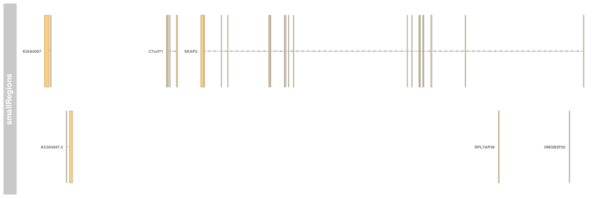

GeneRegionTrack - Building your own gene models.
========================================================

We have seen in previous material how gene models are organised in Bioconductor using the **TxDB** objects.

Gviz may be used in junction with **TxDB** objects to construct the **GeneRegionTrack** objects. 

We saw in the Bioconductor and ChIPseq course that many genomes have pre-build gene annotation within the respective TxDB libraries. Here we will load a **TxDb** for hg19 from the  **TxDb.Hsapiens.UCSC.hg19.knownGene** library.

```r
library(TxDb.Hsapiens.UCSC.hg19.knownGene)

txdb <- TxDb.Hsapiens.UCSC.hg19.knownGene
txdb
```

```
TxDb object:
# Db type: TxDb
# Supporting package: GenomicFeatures
# Data source: UCSC
# Genome: hg19
# Organism: Homo sapiens
# Taxonomy ID: 9606
# UCSC Table: knownGene
# Resource URL: http://genome.ucsc.edu/
# Type of Gene ID: Entrez Gene ID
# Full dataset: yes
# miRBase build ID: GRCh37
# transcript_nrow: 82960
# exon_nrow: 289969
# cds_nrow: 237533
# Db created by: GenomicFeatures package from Bioconductor
# Creation time: 2015-10-07 18:11:28 +0000 (Wed, 07 Oct 2015)
# GenomicFeatures version at creation time: 1.21.30
# RSQLite version at creation time: 1.0.0
# DBSCHEMAVERSION: 1.1
```

GeneRegionTrack - Building your own gene models from a TxDb.
========================================================

Now we have loaded our **TxDb** object and assigned it to *txdb*. We can use this **TxDb** object to construct our **GeneRegionTrack**. Here we focus on chromosome 7 again.


```r
customFromTxDb <- GeneRegionTrack(txdb,chromosome="chr7")
head(customFromTxDb)
```

```
GeneRegionTrack 'GeneRegionTrack'
| genome: hg19
| active chromosome: chr7
| annotation features: 6
```

GeneRegionTrack - Building your own gene models from a TxDb.
========================================================

With our new **GeneRegionTrack** we can now reproduce the gene models using the Bioconductor TxDb annotation.

Here the annotation is different but transcripts overlapping uc003syc are our SKAP2 gene.


```r
plotTracks(customFromTxDb,
           from=26591341,to=27034958,
           transcriptAnnotation="gene")
```

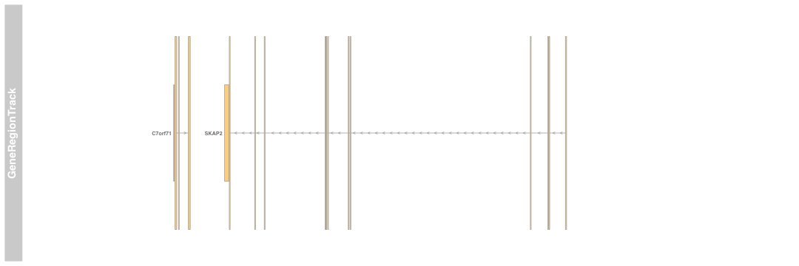

GeneRegionTrack - Building your own gene models from a GFF.
========================================================

Now by combining the ability to create our own **TxDb** objects from GFFs we can create a very custom GeneRegionTrack from a GFF file.


```r
library(GenomicFeatures)
txdbFromGFF <- makeTxDbFromGFF(file = "~/Downloads/tophat2.gff")
customFromTxDb <- GeneRegionTrack(txdbFromGFF,chromosome="chr7")
plotTracks(customFromTxDb,
           from=26591341,to=27034958,
           transcriptAnnotation="gene")
```

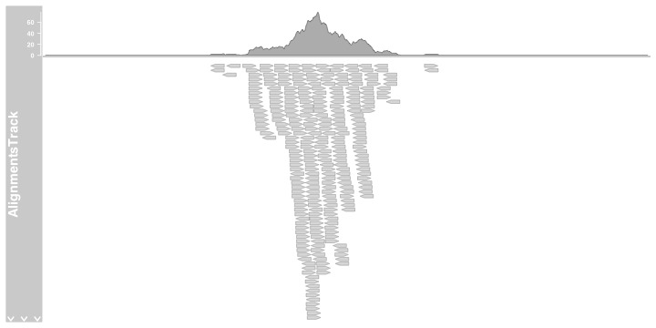

Exercises.
========================================================

SequenceTracks
========================================================

When displaying genomics data it can be important to illustrate the underlying sequence for the genome being viewed.

Gviz uses **SequenceTrack** objects to handle displaying sequencing information.

First we need to get some  sequence information for our genome of interest to display. Here we will use one of the **BSgenome** packages specific for hg19 - **BSgenome.Hsapiens.UCSC.hg19**. This contains the full sequence for hg19 as found in UCSC


```r
library(BSgenome.Hsapiens.UCSC.hg19)
BSgenome.Hsapiens.UCSC.hg19[["chr7"]]
```

```
  159138663-letter "DNAString" instance
seq: NNNNNNNNNNNNNNNNNNNNNNNNNNNNNNNNNN...NNNNNNNNNNNNNNNNNNNNNNNNNNNNNNNNN
```

SequenceTracks - From a BSgenome object
========================================================

We can create a **SequenceTrack** object straight from this **BSgenome** object using the **SequenceTrack()** constructor. 

We can then plot this **SequenceTrack**, as with all tracks, using the **plotTracks()** functions. Here we specify the *from*, *to* and *chromosome* parameters to select a region to display.


```r
sTrack <- SequenceTrack(Hsapiens)
plotTracks(sTrack,from=134887024,to=134887074,
           chromosome = "chr7")
```

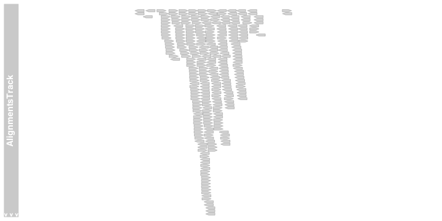

SequenceTracks - From a DNAstringset object
========================================================

We can also specify a DNAstringset object which we have encountered in the Bioconductor and ChIP-seq courses.


SequenceTracks - From a DNAstringset object
========================================================

Or even from a fasta file.

Here we use an example containing only the sequence around the region we are looking at to save space. Since the sequence is only of the region of interest we need specify the sequence limits for the *from* and *to* arguments. With completer fasta files, **from** and **to** would be set as for other **SequenceTrack** examples.


```r
sTrack <- SequenceTrack("Data/chr7Short.fa")
plotTracks(sTrack,from=1,to=50,
           chromosome = "chr7")
```


SequenceTracks - Displaying complement sequence
========================================================

As with IGV, the sequence can be displayed as its complement. This is performed in Gviz by setting the **complement** argument to the **plotTracks()** function to TRUE/T.


SequenceTracks - Displaying strand information
========================================================

We can also add 5' to 3' direction as we have for plotting **GenomeAxisTrack**  objects using the **add53** parameter. This allows for a method to illustrate the strand of the sequence being diplayed.


SequenceTracks - Displaying strand information
========================================================

Notice the 5' and 3' labels have swapped automatically when we have specified the complement sequence.


SequenceTracks - Controlling base display size
========================================================

We can control the size of bases with the **cex** parameter, as with the standard R plotting. 

An interesting feature of this is that when plotted bases overlap, Gviz will provide a colour representation of bases instead of the bases' characters.


```r
plotTracks(sTrack,from=1,to=50,
           chromosome = "chr7")
```

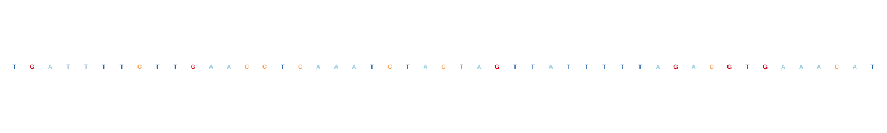

```r
plotTracks(sTrack,from=1,to=50,
           chromosome = "chr7",
           cex=5)
```

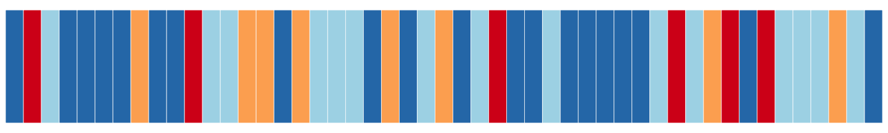


AlignmentsTrack. 
========================================================

So far we have displayed summarised genomics data using GRanges objects or GRanges with associated metadata.

A prominent feature of Gviz is that it can work with Genomic Alignments, providing methods to generate graphical summaries on the fly.

Genomic Alignments are stored in Gviz within the AlignmentsTrack object.

Here we can read Genomic Alignments in from a BAM file, see our file formats course material, by specifying its location.


```r
   peakReads <- AlignmentsTrack("Data/small_Sorted_SRR568129.bam")
   peakReads
```

```
ReferenceAlignmentsTrack 'AlignmentsTrack'
| genome: NA
| active chromosome: chrNA
| referenced file: Data/small_Sorted_SRR568129.bam
| mapping: id=id, cigar=cigar, mapq=mapq, flag=flag, isize=isize, groupid=groupid, status=status, md=md, seq=seq
```

AlignmentsTrack.  Plotting Aligned Reads in Gviz
========================================================

The **AlignmentsTrack** object can be plotted in the same manner as other Gviz tracks using **plotTracks()** function.

Since the BAM file may contain information from all chromosomes we need to specify a chromsome to plot in the *chromosome* parameter and here we specify the *from* and *to* parameters too.


```r
   plotTracks(peakReads,
              chromosome="chr5",
              from=135312577,
              to=135314146)
```

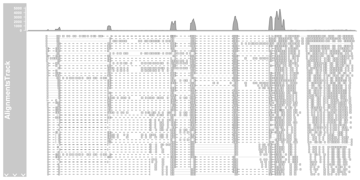

AlignmentsTrack.  Plotting Aligned Reads in Gviz
========================================================

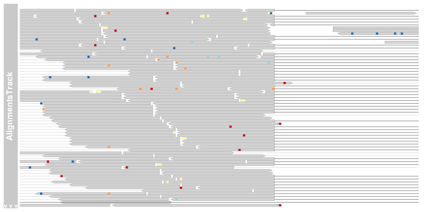


By default AlignmentTracks are rendered as the both the reads themselve and the calculated coverage from these reads.

Reads, as with AnnotationTrack objects, show the strand of the aligned read by the direction of the arrow.

AlignmentsTrack.  Plotting Aligned Reads in Gviz
========================================================

The type of plot/plots produced can be controlled by the *type* argument as we have done for **DataTrack** objects.

The valid types of plots for AlignmentsTrack objects are "pileup", "coverage" and "sashimi" (We've come across sashimi plots before). 

The type "pileup" displays just the reads.

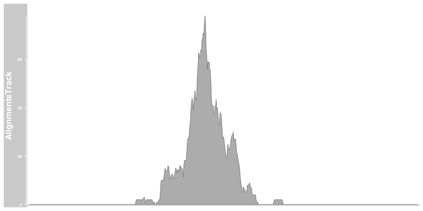

AlignmentsTrack.  Plotting Aligned Reads in Gviz
========================================================

The type "coverage" displays just the coverage (depth of signal over genomic positions) calculated from the genomic alignments.


AlignmentsTrack.  Plotting Aligned Reads in Gviz
========================================================

As we have seen the default display is a combination of "pileup" and "coverage".

We can provide multiple *type* arguments to the **plotTracks()** function as a vector of valid types. The order in vector here does not affect the display order in panels.


AlignmentsTrack.  Plotting Aligned Reads in Gviz
========================================================

As we have seen the default display is a combination of "pileup" and "coverage".

We can provide multiple *type* arguments to the **plotTracks()** function as a vector of valid types. The order in vector here does not affect the display order in panels.

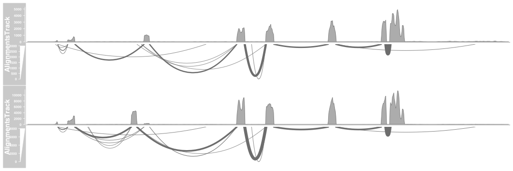


AlignmentsTrack.  Sashimi plots
========================================================

We have seen sashimi plots in IGV when reviewing RNA-seq data.

Sashimi plots display the strength of signal coming from reads spanning splice junctions and so can act to illustrate changes in exon usage between samples.

In IGV, we previous made use of the Bodymap data to show alternative splicing of an exon between heart and liver.

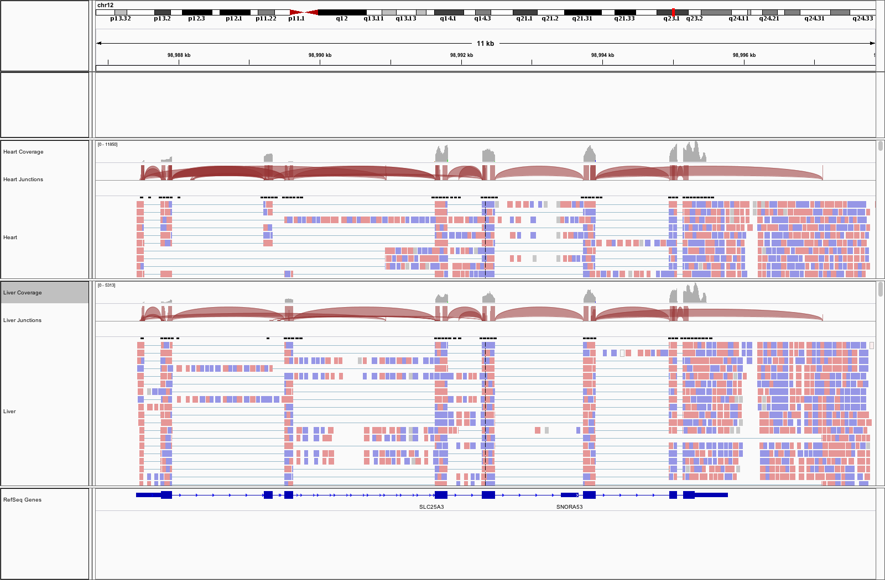

AlignmentsTrack.  Sashimi plots in Gviz
========================================================

To recapitulate this plot, we retrieved the subsection of Bodymap data as BAM files from the IGV tutorial datasets and brought it into the Data directory for the course.

First we must create two AlignmentsTrack objects, one for each tissue's BAM file of aligned reads. 

In this case since we are working with paired-end reads we must specify this by setting the *isPaired* parameter to TRUE


```
ReferenceAlignmentsTrack 'AlignmentsTrack'
| genome: NA
| active chromosome: chrNA
| referenced file: Data/liver.bodyMap.bam
| mapping: id=id, cigar=cigar, mapq=mapq, flag=flag, isize=isize, groupid=groupid, status=status, md=md, seq=seq
```

AlignmentsTrack.  Sashimi plots in Gviz
========================================================

As with **DataTrack** objects we can combine the AlignmentTracks as a vector for plotting with the **plotTracks()** function.

By default we will display the reads and calculated coverage. Here the paired reads and split reads are illustrated by thick and thin lines respectively

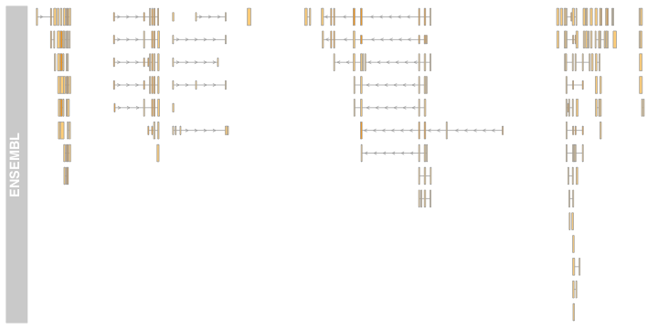

AlignmentsTrack.  Sashimi plots in Gviz
========================================================

To reproduce a plot similar to that in IGV we can simply include the "sashimi" type in the *type* parameter vector, here alongside "coverage" 

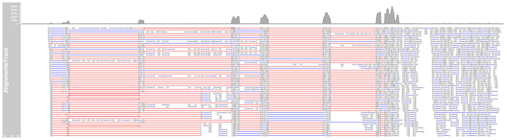

AlignmentsTrack.  Highlighting genomic alignment information.
========================================================

The **AlignmentTrack** object allows for specific parameters controlling how reads are displayed to be passed to the **plotTracks()** function.

Two useful functions are col.gaps and col.mates or lty.gap and lty.mates which will allow us to better disntiguish between gapped alignments (split reads) and gaps between read pairs respectively.


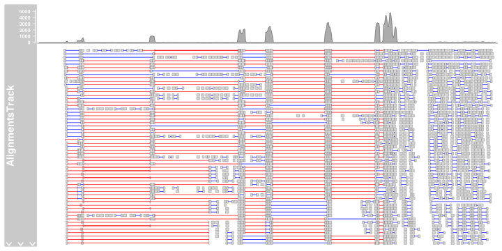

AlignmentsTrack.  Highlighting genomic alignment information.
========================================================

Similarly using lty.gap and lty.mate parameters. 

Line width may also be controlled with lwd.gap and lwd.mate parameters continuing the similarities to Base R plotting.


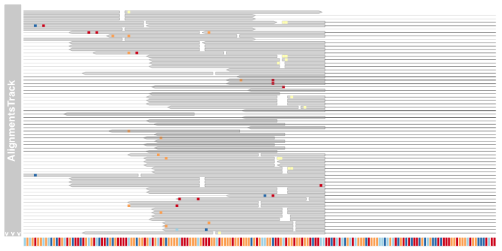

AlignmentsTrack.  Highlighting mismathces to reference.
========================================================

A common purpose in visualising alignment data in broswers is review information relating to mismatches to the genome which may be related to SNPs.

In order to highlight mismatches to the genome reference sequence we must first provide Gviz with some information on the reference sequence.

One method for this is to attach sequence information to the AlignmentsTrack itself providing a **SequenceTrack** object to **referenceSequence** parameter to the **AlignmentsTrack()** constructor. Here we can use the one we made earlier.


AlignmentsTrack.  Highlighting mismatches to reference.
========================================================

Now when we replot the pileup of reads mismatches in the reads are highlighted.

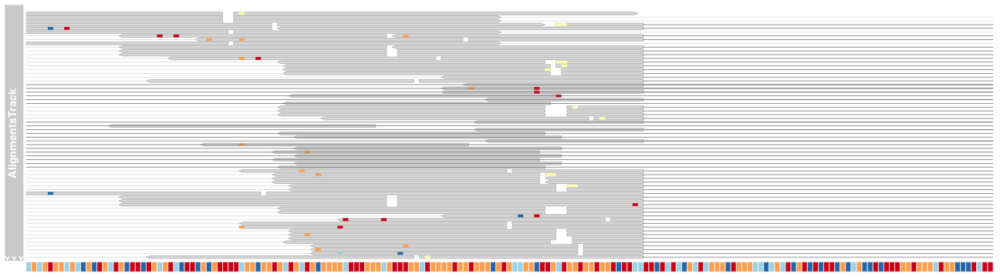
AlignmentsTrack.  Highlighting mismatches to reference.
========================================================

We could also specify the SequenceTrack just in the **plotTracks()** function as shown for the liver reads here. Here we simply include the relevant **SequenceTrack** object as a track to be plotted  alongside the BAM and Gviz connects the dots.


Data from GAlignments.


Exercises
===================


Bringing in External data.
========================================================

Gviz has functions to allow us to import data from external repositories and databases.

As in the IGV course, visualising genomics data in the context of additional genome information and external data held at these repositories provides a deeper insight into our own data.

In this course we will look at two main methods of querying external databases-

* The **UcscTrack** object and constructor
* The **BiomartGeneRegionTrack** object and constructor.

Bringing in External data. Gene models through Biomart
========================================================

We have previously seen how we can use the **biomaRt** Bioconductor package to programatically query various Biomarts (see our previous material).

Gviz allows us to both query Biomart and automatically create a GeneRegionTrack using the **BiomartGeneRegionTrack** objects and **BiomartGeneRegionTrack()** constructor.

Bringing in External data. Gene models through Biomart
========================================================

Here we construct a simple **BiomartGeneRegionTrack** object using the parameters to define locations of interest - "chromsome", "start","end","genome" as well as the Biomart to use, in this case Ensembl by setting the **name** parameter.


```r
bgrTrack <- BiomartGeneRegionTrack(genome="hg19",
                                   start=26591341,
                                   end=27034958,
                                   chromosome = "chr7",
                                   name="ENSEMBL")
```

Bringing in External data. Gene models through Biomart
========================================================

We can then plot the BiomartGeneRegionTrack as we have previous GeneRegionTracks.


```r
plotTracks(bgrTrack)
```

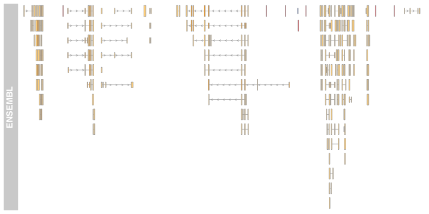

Bringing in External data. Gene models through Biomart
========================================================

Gviz allows the specification of filters to the **BiomartGeneRegionTrack()** constructor using the *filter* parameter.

Gviz use the **BiomaRt** Bioconductor package to query the Biomarts so we can apply the same filters as in BiomaRt, which we saw in our earlier material.


```r
library(biomaRt)
mart = useMart("ensembl", dataset="hsapiens_gene_ensembl")
listFilters(mart)
```

```
                                         name
1                             chromosome_name
2                                       start
3                                         end
4                                  band_start
5                                    band_end
6                                marker_start
7                                  marker_end
8                               encode_region
9                                      strand
10                         chromosomal_region
11                                  with_hgnc
12                  with_hgnc_transcript_name
13                       with_ox_arrayexpress
14                                  with_ccds
15                                with_chembl
16           with_ox_clone_based_ensembl_gene
17     with_ox_clone_based_ensembl_transcript
18              with_ox_clone_based_vega_gene
19        with_ox_clone_based_vega_transcript
20                                with_dbass3
21                                with_dbass5
22                           with_ens_hs_gene
23                    with_ens_hs_translation
24                     with_ens_hs_transcript
25                          with_ens_lrg_gene
26                    with_ens_lrg_transcript
27                                   with_epd
28                                  with_embl
29                            with_entrezgene
30            with_entrezgene_transcript_name
31                                with_genedb
32                                 with_go_id
33                                 with_go_go
34                            with_goslim_goa
35                                   with_hpa
36                                with_merops
37                              with_mim_gene
38                            with_mim_morbid
39                               with_mirbase
40               with_mirbase_transcript_name
41                                  with_ottg
42                                  with_ottt
43                                  with_ottp
44                                   with_pdb
45                            with_protein_id
46                              with_reactome
47                         with_reactome_gene
48                   with_reactome_transcript
49                                  with_rfam
50                  with_rfam_transcript_name
51                           with_refseq_mrna
52                 with_refseq_mrna_predicted
53                          with_refseq_ncrna
54                with_refseq_ncrna_predicted
55                        with_refseq_peptide
56              with_refseq_peptide_predicted
57                            with_rnacentral
58                                  with_ucsc
59                               with_unigene
60                               with_uniparc
61                      with_uniprot_genename
62                      with_uniprotswissprot
63                       with_uniprotsptrembl
64                              with_wikigene
65                            ensembl_gene_id
66                      ensembl_transcript_id
67                         ensembl_peptide_id
68                            ensembl_exon_id
69                                    hgnc_id
70                                hgnc_symbol
71                       hgnc_transcript_name
72                         external_gene_name
73                               arrayexpress
74                                       ccds
75                                     chembl
76              clone_based_ensembl_gene_name
77        clone_based_ensembl_transcript_name
78                 clone_based_vega_gene_name
79           clone_based_vega_transcript_name
80                                dbass3_name
81                                dbass5_name
82                                       embl
83                          ens_hs_transcript
84                         ens_hs_translation
85                               ens_lrg_gene
86                         ens_lrg_transcript
87                                 entrezgene
88                 entrezgene_transcript_name
89                                        epd
90                                      go_id
91                       goslim_goa_accession
92                                        hpa
93                                     genedb
94                                     merops
95                         mim_gene_accession
96                                 mim_morbid
97                                 mirbase_id
98                          mirbase_accession
99                    mirbase_transcript_name
100                                       pdb
101                                protein_id
102                                  reactome
103                             reactome_gene
104                       reactome_transcript
105                               refseq_mrna
106                     refseq_mrna_predicted
107                              refseq_ncrna
108                    refseq_ncrna_predicted
109                            refseq_peptide
110                  refseq_peptide_predicted
111                                      rfam
112                      rfam_transcript_name
113                                rnacentral
114                                      ucsc
115                          uniprot_sptrembl
116                         uniprot_swissprot
117                                   unigene
118                          uniprot_genename
119                                   uniparc
120                                      ottg
121                                      ottt
122                                      ottp
123                               wikigene_id
124                             wikigene_name
125                  with_affy_huex_1_0_st_v2
126                         with_affy_hc_g110
127                        with_affy_hg_focus
128                        with_affy_u133_x3p
129                        with_affy_hg_u133a
130                      with_affy_hg_u133a_2
131                  with_affy_hg_u133_plus_2
132                        with_affy_hg_u133b
133                         with_affy_hg_u95a
134                       with_affy_hg_u95av2
135                         with_affy_hg_u95b
136                         with_affy_hg_u95c
137                         with_affy_hg_u95d
138                         with_affy_hg_u95e
139                        with_affy_hugenefl
140                with_affy_hugene_1_0_st_v1
141                with_affy_hugene_2_0_st_v1
142                         with_affy_hta_2_0
143                       with_affy_primeview
144                      with_agilent_cgh_44b
145     with_efg_agilent_wholegenome_4x44k_v1
146     with_efg_agilent_wholegenome_4x44k_v2
147    with_efg_agilent_sureprint_g3_ge_8x60k
148 with_efg_agilent_sureprint_g3_ge_8x60k_v2
149                    with_codelink_codelink
150                     with_phalanx_onearray
151                with_illumina_humanwg_6_v1
152                with_illumina_humanwg_6_v2
153                with_illumina_humanwg_6_v3
154               with_illumina_humanht_12_v3
155               with_illumina_humanht_12_v4
156               with_illumina_humanref_8_v3
157          with_illumina_humanmethylation27
158         with_illumina_humanmethylation450
159                              affy_hc_g110
160                             affy_hg_focus
161                              affy_hg_u95a
162                            affy_hg_u95av2
163                              affy_hg_u95b
164                              affy_hg_u95c
165                              affy_hg_u95d
166                              affy_hg_u95e
167                           affy_hg_u133a_2
168                             affy_hg_u133a
169                             affy_hg_u133b
170                       affy_hg_u133_plus_2
171                              affy_hta_2_0
172                             affy_hugenefl
173                     affy_hugene_1_0_st_v1
174                     affy_hugene_2_0_st_v1
175                       affy_huex_1_0_st_v2
176                            affy_primeview
177                             affy_u133_x3p
178                                  codelink
179                           agilent_cgh_44b
180         efg_agilent_sureprint_g3_ge_8x60k
181      efg_agilent_sureprint_g3_ge_8x60k_v2
182          efg_agilent_wholegenome_4x44k_v1
183          efg_agilent_wholegenome_4x44k_v2
184             illumina_human_methylation_27
185            illumina_human_methylation_450
186                    illumina_humanht_12_v3
187                    illumina_humanht_12_v4
188                    illumina_humanref_8_v3
189                     illumina_humanwg_6_v1
190                     illumina_humanwg_6_v2
191                     illumina_humanwg_6_v3
192                          phalanx_onearray
193                          transcript_count
194                                   biotype
195                        transcript_biotype
196                                    source
197                         transcript_source
198                                    status
199                         transcript_status
200                            transcript_tsl
201                  transcript_gencode_basic
202                         transcript_appris
203                     phenotype_description
204                          phenotype_source
205                          go_evidence_code
206                            go_parent_term
207                            go_parent_name
208                         with_paralog_hsap
209                         with_homolog_vpac
210                         with_homolog_pfor
211                         with_homolog_acar
212                         with_homolog_dnov
213                         with_homolog_gmor
214                         with_homolog_ogar
215                         with_homolog_cele
216                         with_homolog_fcat
217                         with_homolog_amex
218                         with_homolog_ggal
219                         with_homolog_ptro
220                         with_homolog_psin
221                         with_homolog_cint
222                         with_homolog_csav
223                         with_homolog_lcha
224                         with_homolog_sara
225                         with_homolog_btau
226                         with_homolog_cfam
227                         with_homolog_ttru
228                         with_homolog_apla
229                         with_homolog_dmel
230                         with_homolog_lafr
231                         with_homolog_mfur
232                         with_homolog_falb
233                         with_homolog_trub
234                         with_homolog_nleu
235                         with_homolog_ggor
236                         with_homolog_cpor
237                         with_homolog_eeur
238                         with_homolog_ecab
239                         with_homolog_dord
240                         with_homolog_pmar
241                         with_homolog_etel
242                         with_homolog_mmul
243                         with_homolog_cjac
244                         with_homolog_olat
245                         with_homolog_pvam
246                         with_homolog_mluc
247                         with_homolog_mmus
248                         with_homolog_mmur
249                         with_homolog_onil
250                         with_homolog_panu
251                         with_homolog_mdom
252                         with_homolog_pabe
253                         with_homolog_amel
254                         with_homolog_sscr
255                         with_homolog_opri
256                         with_homolog_xmac
257                         with_homolog_oana
258                         with_homolog_ocun
259                         with_homolog_rnor
260                         with_homolog_pcap
261                         with_homolog_oari
262                         with_homolog_chof
263                         with_homolog_locu
264                         with_homolog_itri
265                         with_homolog_gacu
266                         with_homolog_tsyr
267                         with_homolog_shar
268                         with_homolog_tnig
269                         with_homolog_tbel
270                         with_homolog_mgal
271                         with_homolog_csab
272                         with_homolog_meug
273                         with_homolog_xtro
274                         with_homolog_scer
275                         with_homolog_tgut
276                         with_homolog_drer
277                                 with_coil
278                               with_gene3d
279                                with_hamap
280                           with_hmmpanther
281                             with_interpro
282                       with_low_complexity
283                 with_protein_feature_pfam
284                              with_profile
285                                with_pirsf
286               with_protein_feature_prints
287                              with_prosite
288                                with_smart
289                          with_superfamily
290                              with_tigrfam
291                              with_signalp
292                                with_tmhmm
293                          with_blastprodom
294                                   tigrfam
295                                    gene3d
296                                     hamap
297                               superfamily
298                                     smart
299                                     pirsf
300                                    family
301                                      pfam
302                                hmmpanther
303                                    prints
304                                   profile
305                                   prosite
306                                  interpro
307                germ_line_variation_source
308                  somatic_variation_source
309                        with_validated_snp
310                            so_parent_name
                                                         description
1                                                    Chromosome name
2                                                    Gene Start (bp)
3                                                      Gene End (bp)
4                                                         Band Start
5                                                           Band End
6                                                       Marker Start
7                                                         Marker End
8                                                      Encode region
9                                                             Strand
10         Chromosome Regions (e.g 1:100:10000:-1,1:100000:200000:1)
11                                                   with HGNC ID(s)
12                                      with HGNC transcript name(s)
13                                           with ArrayExpress ID(s)
14                                                   with CCDS ID(s)
15                                                 with ChEMBL ID(s)
16                               with clone based Ensembl gene ID(s)
17                         with clone based Ensembl transcript ID(s)
18                                  with clone based VEGA gene ID(s)
19                            with clone based VEGA transcript ID(s)
20                                                 with DBASS3 ID(s)
21                                                 with DBASS5 ID(s)
22                                       with Ensembl Human Gene IDs
23                                with Ensembl Human Translation IDs
24                                 with Ensembl Human Transcript IDs
25                                       with Ensembl LRG gene ID(s)
26                                 with Ensembl LRG transcript ID(s)
27                                                    with EPD ID(s)
28                                                   with EMBL ID(s)
29                                             with EntrezGene ID(s)
30                                with EntrezGene Transcript Name(s)
31                                                 with GeneDB ID(s)
32                                         with GO Term Accession(s)
33                                                     with GO ID(s)
34                                                with GOSlim GOA(s)
35                                    with Human Protein Atlas ID(s)
36                                                 with MEROPS ID(s)
37                                               with MIM gene ID(s)
38                                             with MIM MORBID ID(s)
39                                                with miRBase ID(s)
40                                   with miRBase transcript name(s)
41                                       with VEGA gene ID(s) (OTTG)
42                                 with VEGA transcript ID(s) (OTTT)
43                                    with VEGA protein ID(s) (OTTP)
44                                                    with PDB ID(s)
45                                      with protein (Genbank) ID(s)
46                                               with Reactome ID(s)
47                                          with Reactome gene ID(s)
48                                    with Reactome transcript ID(s)
49                                                   with Rfam ID(s)
50                                      with Rfam transcript name(s)
51                                            with RefSeq mRNA ID(s)
52                                  with RefSeq mRNA predicted ID(s)
53                                           with RefSeq ncRNA ID(s)
54                                 with RefSeq ncRNA predicted ID(s)
55                                         with RefSeq protein ID(s)
56                               with RefSeq predicted protein ID(s)
57                                             with RNACentral ID(s)
58                                                   with UCSC ID(s)
59                                                with UniGene ID(s)
60                                                with UniParc ID(s)
61                                         with UniProt Gene Name(s)
62                               with UniProt/SwissProt Accession(s)
63                                  with UniProt/TrEMBL Accession(s)
64                                               with WikiGene ID(s)
65                         Ensembl Gene ID(s) [e.g. ENSG00000139618]
66                   Ensembl Transcript ID(s) [e.g. ENST00000380152]
67                      Ensembl protein ID(s) [e.g. ENSP00000369497]
68                         Ensembl exon ID(s) [e.g. ENSE00001508081]
69                                       HGNC ID(s) [e.g. HGNC:8030]
70                                        HGNC symbol(s) [e.g. NTN3]
71                        HGNC transcript name(s) [e.g. QRSL1P2-001]
72                              Associated Gene Name(s) [e.g. BRCA2]
73                         ArrayExpress ID(s) [e.g. ENSG00000241328]
74                                       CCDS ID(s) [e.g. CCDS10187]
75                           ChEMBL ID(s) ID(s) [e.g. CHEMBL1075092]
76                Clone based Ensembl gene name(s) [e.g. AL162430.1]
77      Clone based Ensembl transcript name(s) [e.g. AL162430.1-201]
78                 Clone based VEGA gene name(s) [e.g. RP11-815M8.1]
79       Clone based VEGA transcript name(s) [e.g. RP5-859I17.3-001]
80                                     DBASS3 Gene Name [e.g. PDE6B]
81                                      DBASS5 Gene Name [e.g. HCN2]
82                                        EMBL ID(s) [e.g. AY495257]
83               Ensembl Human Transcript IDs [e.g. ENST00000225964]
84              Ensembl Human Translation IDs [e.g. ENSP00000376544]
85                         LRG to Ensembl link gene IDs [e.g. LRG_3]
86               LRG to Ensembl link transcript IDs [e.g. LRG_226t1]
87                                    EntrezGene ID(s) [e.g. 115286]
88         EntrezGene transcript name ID(s) [e.g. CTD-2350J17.1-002]
89             Eukaryotic Promoter Database (EPD) ID(s) [e.g. 11050]
90                            GO Term Accession(s) [e.g. GO:0005515]
91                        GOSlim GOA Accessions(s) [e.g. GO:0005623]
92                  Human Protein Atlas Antibody ID [e.g. HPA002549]
93                                 GeneDB ID [e.g. LmjF.10.1080:pep]
94                                       MEROPS ID(s) [e.g. C19.028]
95                               MIM Gene Accession(s) [e.g. 611882]
96                                    MIM MORBID ID(s) [e.g. 100100]
97                                  miRBase ID(s) [e.g. hsa-mir-137]
98                             miRBase Accession(s) [e.g. MI0000454]
99               miRBase transcript name [e.g. hsa-mir-6724-1.3-201]
100                                            PDB ID(s) [e.g. 1J47]
101                          Protein (Genbank) ID(s) [e.g. ACU09872]
102                               Reactome ID(s) [e.g. R-HSA-392499]
103                          Reactome gene ID(s) [e.g. R-HSA-381070]
104                   Reactome transcript ID(s) [e.g. R-HSA-5368287]
105                            RefSeq mRNA ID(s) [e.g. NM_001195597]
106                  RefSeq Predicted mRNA ID(s) [e.g. XM_006724158]
107                              RefSeq ncRNA ID(s) [e.g. NR_125810]
108                    RefSeq Predicted ncRNA ID(s) [e.g. XR_251015]
109                         RefSeq protein ID(s) [e.g. NP_001005353]
110               RefSeq predicted protein ID(s) [e.g. XP_011520427]
111                                        Rfam ID(s) [e.g. RF00432]
112                     Rfam transcript name(s) [e.g. Y_RNA.837-201]
113                            RNACentral ID(s) [e.g. URS000019B707]
114                                     UCSC ID(s) [e.g. uc002cqj.3]
115                        UniProt/TrEMBL Accession(s) [e.g. U5Z754]
116                     UniProt/Swissprot Accession(s) [e.g. Q13068]
117                                   UniGene ID(s) [e.g. Hs.146092]
118                            UniProt Accession ID(s) [e.g. P03886]
119                               UniParc ID(s) [e.g. UPI0000000AA1]
120                 VEGA Gene ID(s) (OTTG) [e.g. OTTHUMG00000036159]
121           VEGA Transcript ID(s) (OTTT) [e.g. OTTHUMT00000088063]
122              VEGA Protein ID(s) (OTTP) [e.g. OTTHUMP00000277309]
123                                     WikiGene ID(s) [e.g. 115286]
124                                 WikiGene Name(s) [e.g. SLC25A26]
125         with Affymetrix Microarray huex 1 0 st v2 probeset ID(s)
126                with Affymetrix Microarray hc g110 probeset ID(s)
127               with Affymetrix Microarray hg Focus probeset ID(s)
128               with Affymetrix Microarray u133 x3p probeset ID(s)
129               with Affymetrix Microarray hg u133a probeset ID(s)
130             with Affymetrix Microarray hg u133a 2 probeset ID(s)
131         with Affymetrix Microarray hg u133 plus 2 probeset ID(s)
132               with Affymetrix Microarray hg u133b probeset ID(s)
133                with Affymetrix Microarray hg u95a probeset ID(s)
134              with Affymetrix Microarray hg u95av2 ID(s) probeset
135                with Affymetrix Microarray hg u95b probeset ID(s)
136                with Affymetrix Microarray hg u95c probeset ID(s)
137                with Affymetrix Microarray hg u95d probeset ID(s)
138                with Affymetrix Microarray hg u95e probeset ID(s)
139               with Affymetrix Microarray HuGeneFL probeset ID(s)
140       with Affymetrix Microarray hugene 1 0 st v1 probeset ID(s)
141                with Affymetrix Microarray hugene 2 0 st v1 ID(s)
142                with Affymetrix Microarray HTA-2_0 probeset ID(s)
143                       with Affymetrix Microarray primeview ID(s)
144                                 with Agilent CGH 44b probe ID(s)
145                      with Efg agilent wholegenome 4x44k v1 ID(s)
146                      with Efg agilent wholegenome 4x44k v2 ID(s)
147                     with Efg agilent sureprint g3 ge 8x60k ID(s)
148                  with Efg agilent sureprint g3 ge 8x60k v2 ID(s)
149                                        with Codelink probe ID(s)
150                                with Phalanx onearray probe ID(s)
151                           with Illumina HumanWG 6 v1 probe ID(s)
152                           with Illumina HumanWG 6 v2 probe ID(s)
153                           with Illumina HumanWG 6 v3 probe ID(s)
154                         with Illumina Human HT 12 v3 probe ID(s)
155                         with Illumina Human HT 12 v4 probe ID(s)
156                          with Illumina Human HT 8 v3 probe ID(s)
157                   with Illumina human methylation 27 probe ID(s)
158                  with Illumina human methylation 450 probe ID(s)
159                      Affy hc g110 probeset ID(s) [e.g. 113_i_at]
160                    Affy hg focus probeset ID(s) [e.g. 201612_at]
161                      Affy hg u95a probeset ID(s) [e.g. 32647_at]
162                    Affy hg u95av2 probeset ID(s) [e.g. 32647_at]
163                      Affy hg u95b probeset ID(s) [e.g. 53925_at]
164                    Affy hg u95c probeset ID(s) [e.g. 61056_r_at]
165                      Affy hg u95d probeset ID(s) [e.g. 79632_at]
166                      Affy hg u95e probeset ID(s) [e.g. 79965_at]
167                Affy hg u133a 2 probeset ID(s) [e.g. 200874_s_at]
168                  Affy hg u133a probeset ID(s) [e.g. 200874_s_at]
169                    Affy hg u133b probeset ID(s) [e.g. 227057_at]
170              Affy hg u133 plus 2 probeset ID(s) [e.g. 241843_at]
171                 Affy HTA_2_0 probeset ID(s) [e.g. TC04000093.hg]
172                 Affy HuGene FL probeset ID(s) [e.g. M58525_s_at]
173              Affy HuGene 1_0 st v1 probeset ID(s) [e.g. 8065566]
174             Affy HuGene 2_0 st v1 probeset ID(s) [e.g. 16964973]
175                Affy HuEx 1_0 st v2 probeset ID(s) [e.g. 4033465]
176         Affymetrix Microarray Primeview ID(s) [e.g. 11763890_at]
177        Affy u133 x3p probeset ID(s) [e.g. Hs2.205326.1.A1_3p_at]
178                             Codelink probe ID(s) [e.g. GE550734]
179                  Agilent CGH 44b probe ID(s) [e.g. A_14_P131077]
180   Agilent Sureprint G3 GE 8x60k probe ID(s) [e.g. A_33_P3356022]
181 Agilent Sureprint G3 GE 8x60k v2 probe ID(s) [e.g. A_24_P182122]
182     Agilent WholeGenome 4x44k v1 probe ID(s) [e.g. A_32_P196615]
183    Agilent WholeGenome 4x44k v2 probe ID(s) [e.g. A_33_P3356022]
184      Illumina Human methylation 27 probe ID(s) [e.g. cg20103550]
185     Illumina Human methylation 450 probe ID(s) [e.g. cg26891645]
186          Illumina Human HT 12 v3 probe ID(s) [e.g. ILMN_2079225]
187          Illumina Human HT 12 v4 probe ID(s) [e.g. ILMN_2079225]
188          Illumina Human Ref 8 v3 probe ID(s) [e.g. ILMN_1768251]
189              Illumina HumanWG 6 V1 probe ID(s) [e.g. 0000940471]
190            Illumina HumanWG 6 V2 probe ID(s) [e.g. ILMN_1748182]
191            Illumina HumanWG 6 v3 probe ID(s) [e.g. ILMN_2103362]
192                Phalanx OneArray probe ID(s) [e.g. PH_hs_0031946]
193                                              Transcript count >=
194                                                             Type
195                                                  Transcript Type
196                                                    Source (gene)
197                                              Source (transcript)
198                                                    Status (gene)
199                                              Status (transcript)
200                                   Transcript Support Level (TSL)
201                                         GENCODE basic annotation
202                                                APPRIS annotation
203                                            Phenotype description
204                                                 Phenotype source
205                                                 GO Evidence code
206                                            Parent term accession
207                                                 Parent term name
208                                           Paralogous Human Genes
209                                         Orthologous Alpaca Genes
210                                   Orthologous Amazon molly Genes
211                                   Orthologous Anole Lizard Genes
212                                      Orthologous Armadillo Genes
213                                   Orthologous Atlantic Cod Genes
214                                       Orthologous Bushbaby Genes
215                         Orthologous Caenorhabditis elegans Genes
216                                            Orthologous Cat Genes
217                                      Orthologous Cave fish Genes
218                                        Orthologous Chicken Genes
219                                     Orthologous Chimpanzee Genes
220                       Orthologous Chinese softshell turtle Genes
221                             Orthologous Ciona intestinalis genes
222                                 Orthologous Ciona savignyi Genes
223                                     Orthologous Coelacanth Genes
224                                   Orthologous Common Shrew Genes
225                                            Orthologous Cow Genes
226                                            Orthologous Dog Genes
227                                        Orthologous Dolphin Genes
228                                           Orthologous Duck Genes
229                                     Orthologous Drosophila Genes
230                                       Orthologous Elephant Genes
231                                         Orthologous Ferret Genes
232                                     Orthologous Flycatcher Genes
233                                           Orthologous Fugu Genes
234                                         Orthologous Gibbon Genes
235                                        Orthologous Gorilla Genes
236                                     Orthologous Guinea Pig Genes
237                                       Orthologous Hedgehog Genes
238                                          Orthologous Horse Genes
239                                   Orthologous Kangaroo Rat Genes
240                                        Orthologous Lamprey Genes
241                         Orthologous Lesser hedgehog tenrec Genes
242                                        Orthologous Macaque Genes
243                                       Orthologous Marmoset Genes
244                                         Orthologous Medaka Genes
245                                        Orthologous Megabat Genes
246                                       Orthologous Microbat Genes
247                                          Orthologous Mouse Genes
248                                    Orthologous Mouse Lemur Genes
249                                   Orthologous Nile tilapia Genes
250                                   Orthologous Olive baboon Genes
251                                        Orthologous Opossum Genes
252                                      Orthologous Orangutan Genes
253                                          Orthologous Panda Genes
254                                            Orthologous Pig Genes
255                                           Orthologous Pika Genes
256                                      Orthologous Platyfish Genes
257                                       Orthologous Platypus Genes
258                                         Orthologous Rabbit Genes
259                                            Orthologous Rat Genes
260                                     Orthologous Rock Hyrax Genes
261                                          Orthologous Sheep Genes
262                                          Orthologous Sloth Genes
263                                    Orthologous Spotted gar Genes
264                                       Orthologous Squirrel Genes
265                                    Orthologous Stickleback Genes
266                                        Orthologous Tarsier Genes
267                                Orthologous Tasmanian Devil Genes
268                                      Orthologous Tetraodon Genes
269                                     Orthologous Tree Shrew Genes
270                                         Orthologous Turkey Genes
271                                     Orthologous Vervet-AGM Genes
272                                        Orthologous Wallaby Genes
273                                        Orthologous Xenopus Genes
274                                          Orthologous Yeast Genes
275                                    Orthologous Zebra Finch Genes
276                                      Orthologous Zebrafish Genes
277                                        with coiled coil (ncoils)
278                                                with Gene3D ID(s)
279                                                 with HAMAP ID(s)
280                                            with HMMPanther ID(s)
281                                              with InterPro ID(s)
282                                        with low complexity (SEG)
283                                                  with Pfam ID(s)
284                                                with Pfscan ID(s)
285                                                 with PIRSF ID(s)
286                                                with PRINTS ID(s)
287                                           with ScanProsite ID(s)
288                                                 with SMART ID(s)
289                                           with SUPERFAMILY ID(s)
290                                               with TIGRFAM ID(s)
291                                              with signal peptide
292                                with Transmembrane domain (tmhmm)
293                           with Protein feature blastprodom ID(s)
294                                   TIGRfam ID(s) [e.g. TIGR00172]
295                                  Gene3D ID(s) [e.g. 1.20.210.10]
296                            HAMAP Accession ID(s) [e.g. MF_01209]
297                                Superfamily ID(s) [e.g. SSF47095]
298                                       SMART ID(s) [e.g. SM00398]
299                                   PIRSF ID(s) [e.g. PIRSF037653]
300                Ensembl Protein Family ID(s) [e.g. PTHR10000_SF7]
301                                        PFAM ID(s) [e.g. PF00046]
302                                HMMPanther ID(s) [e.g. PTHR12369]
303                                      PRINTS ID(s) [e.g. PR00194]
304                                     PROFILE ID(s) [e.g. PS50855]
305                                     PROSITE ID(s) [e.g. PS00668]
306                                  Interpro ID(s) [e.g. IPR007087]
307                limit to genes with germline variant data sources
308                      limit to genes with somatic variant sources
309                                      Variant supporting evidence
310                                                 Parent term name
```

Bringing in External data. Gene models through Biomart
========================================================

Here we select only genes which have been annotated by both havana and ensembl (so called Golden Transcripts)


```r
bgrTrack <- BiomartGeneRegionTrack(genome="hg19",
                                   start=26591341,
                                   end=27034958,
                                   chromosome = "chr7",
                                   name="ENSEMBL",                              filter=list(source="ensembl_havana"))
```

Bringing in External data. Gene models through Biomart
========================================================

Once we have retrieved our filtered gene models we can plot them as before.


```r
plotTracks(bgrTrack)
```


Bringing in External data. Gene models through Biomart
========================================================

Once we have retrieved our filtered gene models we can plot them as before.


```r
plotTracks(bgrTrack)
```


Bringing in External data. Tracks from UCSC
========================================================

A well known browser and source of genomic data and annotation is the UCSC genome browser. Gviz can create track directly from UCSC tables using the functionality from **rtracklayer** Bioconductor package.

The **Ucsctrack()** constructor and object allow for the query and track construction of a variety of data types. The **Ucsctrack()** function therefore requires us to specify the track type we expect using the *trackType* parameter as well as the required UCSC table using the **track**. 


Bringing in External data. Tracks from UCSC
========================================================

To understand which tables are available we can query the **rtracktables** package to identify track and table names.


```r
library(rtracklayer)
session <- browserSession()
genome(session) <- "hg19"
trackNames(session)
```

```
              Base Position              Alt Haplotypes 
                    "ruler"              "altLocations" 
                   Assembly               BAC End Pairs 
                     "gold"               "bacEndPairs" 
                  BU ORChID             Chromosome Band 
         "wgEncodeBuOrchid"                  "cytoBand" 
              deCODE Recomb                ENCODE Pilot 
               "decodeRmap"             "encodeRegions" 
                FISH Clones            Fosmid End Pairs 
               "fishClones"               "fosEndPairs" 
                        Gap                  GC Percent 
                      "gap"                   "gc5Base" 
               GRC Incident             GRC Map Contigs 
            "grcIncidentDb"                   "ctgPos2" 
          GRC Patch Release                   Hg18 Diff 
        "altSeqComposite10"            "hg19ContigDiff" 
                  Hg38 Diff                Hi Seq Depth 
           "hg38ContigDiff"                "hiSeqDepth" 
                      INSDC                 LRG Regions 
              "ucscToINSDC"                       "lrg" 
                Map Contigs                 Mappability 
                   "ctgPos"        "wgEncodeMapability" 
                Recomb Rate               Restr Enzymes 
               "recombRate"                   "cutters" 
                Short Match                 STS Markers 
               "oligoMatch"                    "stsMap" 
                 UCSC Genes                RefSeq Genes 
                "knownGene"                   "refGene" 
              AceView Genes                    Augustus 
                  "acembly"              "augustusGene" 
                       CCDS               Ensembl Genes 
                 "ccdsGene"                   "ensGene" 
                    EvoFold                    Exoniphy 
                  "evofold"                  "exoniphy" 
                 GENCODE...                Geneid Genes 
     "wgEncodeGencodeSuper"                    "geneid" 
              Genscan Genes                   H-Inv 7.0 
                  "genscan"           "hinv70Composite" 
          IKMC Genes Mapped                 lincRNAs... 
                   "hgIkmc"                  "lincRNAs" 
            LRG Transcripts                   MGC Genes 
         "lrgTranscriptAli"               "mgcFullMrna" 
                     N-SCAN              Old UCSC Genes 
                "nscanGene"             "knownGeneOld6" 
             ORFeome Clones                Other RefSeq 
              "orfeomeMrna"               "xenoRefGene" 
          Pfam in UCSC Gene            Retroposed Genes 
             "ucscGenePfam"             "ucscRetroAli5" 
                  SGP Genes                   SIB Genes 
                  "sgpGene"                   "sibGene" 
                  sno/miRNA                 TransMap... 
                    "wgRna"                  "transMap" 
                 tRNA Genes             UCSC Alt Events 
                    "tRNAs"                  "knownAlt" 
                    UniProt                  Vega Genes 
                "spUniprot"         "vegaGeneComposite" 
              Yale Pseudo60                Publications 
             "pseudoYale60"                      "pubs" 
               ClinGen CNVs            ClinVar Variants 
            "iscaComposite"                   "clinvar" 
               Coriell CNVs                      COSMIC 
            "coriellDelDup"                    "cosmic" 
                   DECIPHER           Development Delay 
                 "decipher"               "cnvDevDelay" 
                   GAD View                 GeneReviews 
                      "gad"               "geneReviews" 
               GWAS Catalog               HGMD Variants 
              "gwasCatalog"                      "hgmd" 
               Lens Patents               LOVD Variants 
                   "patSeq"                      "lovd" 
              MGI Mouse QTL                OMIM AV SNPs 
             "jaxQtlMapped"                 "omimAvSnp" 
                 OMIM Genes             OMIM Pheno Loci 
                "omimGene2"              "omimLocation" 
              RGD Human QTL                 RGD Rat QTL 
                   "rgdQtl"                 "rgdRatQtl" 
           UniProt Variants               Web Sequences 
                    "spMut"              "pubsBingBlat" 
                Human mRNAs                Spliced ESTs 
                     "mrna"                 "intronEst" 
                  CGAP SAGE                 Gene Bounds 
                 "cgapSage"                "rnaCluster" 
                      H-Inv                  Human ESTs 
             "HInvGeneMrna"                       "est" 
          Human RNA Editing                  Other ESTs 
                   "darned"                   "xenoEst" 
                Other mRNAs                     Poly(A) 
                 "xenoMrna"                     "polyA" 
                  PolyA-Seq            SIB Alt-Splicing 
            "polyASeqSites"                "sibTxGraph" 
                    UniGene                        GTEx 
                "uniGene_3"                  "gtexGene" 
            Affy Exon Array                  Affy GNF1H 
            "affyExonArray"                 "affyGnf1h" 
               Affy RNA Loc                   Affy U133 
      "wgEncodeAffyRnaChip"                  "affyU133" 
             Affy U133Plus2                    Affy U95 
            "affyU133Plus2"                   "affyU95" 
                Allen Brain               Burge RNA-seq 
            "allenBrainAli" "burgeRnaSeqGemMapperAlign" 
         CSHL Small RNA-seq           ENC Exon Array... 
  "wgEncodeCshlShortRnaSeq"    "wgEncodeExonArraySuper" 
            ENC ProtGeno...              ENC RNA-seq... 
    "wgEncodeProtGenoSuper"       "wgEncodeRnaSeqSuper" 
                GIS RNA PET                 GNF Atlas 2 
        "wgEncodeGisRnaPet"                 "gnfAtlas2" 
          GWIPS-viz Riboseq               Illumina WG-6 
          "gwipsvizRiboseq"            "illuminaProbes" 
               PeptideAtlas                qPCR Primers 
         "peptideAtlas2014"               "qPcrPrimers" 
             RIKEN CAGE Loc                Sestan Brain 
        "wgEncodeRikenCage"          "sestanBrainAtlas" 
       ENCODE Regulation...                 CD34 DnaseI 
              "wgEncodeReg"                "eioJcviNAS" 
             CpG Islands...            ENC Chromatin... 
           "cpgIslandSuper"        "wgEncodeChromSuper" 
          ENC DNA Methyl...          ENC DNase/FAIRE... 
   "wgEncodeDnaMethylSuper"        "wgEncodeDNAseSuper" 
             ENC Histone...          ENC RNA Binding... 
     "wgEncodeHistoneSuper"          "wgEncodeRbpSuper" 
          ENC TF Binding...              FSU Repli-chip 
   "wgEncodeTfBindingSuper"      "wgEncodeFsuRepliChip" 
            Genome Segments           NKI Nuc Lamina... 
  "wgEncodeAwgSegmentation"              "laminB1Super" 
                   ORegAnno            Stanf Nucleosome 
                 "oreganno"         "wgEncodeSydhNsome" 
            SUNY SwitchGear              SwitchGear TSS 
   "wgEncodeSunySwitchgear"               "switchDbTss" 
             TFBS Conserved              TS miRNA sites 
            "tfbsConsSites"               "targetScanS" 
          UCSF Brain Methyl             UMMS Brain Hist 
          "ucsfBrainMethyl"         "uMassBrainHistone" 
               UW Repli-seq             Vista Enhancers 
       "wgEncodeUwRepliSeq"            "vistaEnhancers" 
               Conservation                 Cons 46-Way 
               "cons100way"                 "cons46way" 
           Cons Indels MmCf                     Evo Cpg 
     "consIndelsHgMmCanFam"                    "evoCpg" 
                       GERP              phastBias gBGC 
             "allHg19RS_BW"                 "phastBias" 
          Primate Chain/Net         Placental Chain/Net 
          "primateChainNet"         "placentalChainNet" 
       Vertebrate Chain/Net           Gorilla Chain/Net 
       "vertebrateChainNet"           "chainNetGorGor3" 
                5% Lowest S            H-C Coding Diffs 
               "ntSssTop5p"      "ntHumChimpCodingDiff" 
          Neandertal Methyl              Neandertal Seq 
    "neandertalMethylation"                "ntSeqReads" 
                     S SNPs            Sel Swp Scan (S) 
                "ntSssSnps"          "ntSssZScorePMVar" 
            Denisova Methyl                Denisova Seq 
      "denisovaMethylation"            "dhcBamDenisova" 
          Denisova Variants            Mod Hum Variants 
      "dhcVcfDenisovaPinky"              "dhcVcfModern" 
             Modern Derived            Common SNPs(146) 
          "dhcHumDerDenAnc"              "snp146Common" 
           1000G Ph1 Accsbl              1000G Ph1 Vars 
   "tgpPhase1Accessibility"                 "tgpPhase1" 
           1000G Ph3 Accsbl              1000G Ph3 Vars 
   "tgpPhase3Accessibility"                 "tgpPhase3" 
              All SNPs(138)               All SNPs(141) 
                   "snp138"                    "snp141" 
              All SNPs(142)               All SNPs(144) 
                   "snp142"                    "snp144" 
              All SNPs(146)            Common SNPs(138) 
                   "snp146"              "snp138Common" 
           Common SNPs(141)            Common SNPs(142) 
             "snp141Common"              "snp142Common" 
           Common SNPs(144)              DGV Struct Var 
             "snp144Common"                   "dgvPlus" 
               EVS Variants                        ExAC 
               "evsEsp6500"                      "exac" 
          Flagged SNPs(138)           Flagged SNPs(141) 
            "snp138Flagged"             "snp141Flagged" 
          Flagged SNPs(142)           Flagged SNPs(144) 
            "snp142Flagged"             "snp144Flagged" 
          Flagged SNPs(146)             Genome Variants 
            "snp146Flagged"                     "pgSnp" 
                GIS DNA PET               HAIB Genotype 
        "wgEncodeGisDnaPet"      "wgEncodeHaibGenotype" 
                HapMap SNPs            HGDP Allele Freq 
               "hapmapSnps"                   "hgdpGeo" 
            Mult. SNPs(138)             Mult. SNPs(142) 
               "snp138Mult"                "snp142Mult" 
            Mult. SNPs(144)             Mult. SNPs(146) 
               "snp144Mult"                "snp146Mult" 
             NumtS Sequence              SNP/CNV Arrays 
                  "numtSeq"            "genotypeArrays" 
               RepeatMasker            Interrupted Rpts 
                     "rmsk"             "nestedRepeats" 
             Microsatellite              Segmental Dups 
                 "microsat"          "genomicSuperDups" 
                 Self Chain              Simple Repeats 
                "chainSelf"              "simpleRepeat" 
```

```r
query <- ucscTableQuery(session, "Ensembl Genes",
                        GRangesForUCSCGenome("hg19", "chr7",
                                             IRanges(26591341,27034958)))
tableNames(query)
```

```
[1] "ensGene"           "ccdsInfo"          "ensGtp"           
[4] "ensPep"            "ensemblSource"     "ensemblToGeneName"
[7] "knownToEnsembl"   
```

Bringing in External data. Tracks from UCSC
========================================================


```r
ucscTrack <- UcscTrack(genome = "hg19",
                       chromosome = "chr7",
                       track = "ensGene",
                       from = 26591341,
                       to = 27034958,
                       trackType = "GeneRegionTrack",
                       rstarts = "exonStarts",
                       rends = "exonEnds",
                       gene ="name",
                       symbol = "name2",
                       transcript = "name",
                       strand = "strand"
)
```

Bringing in External data. Tracks from UCSC as DataTrack
========================================================

In the same fashion we can take advantage of other types of UCSC data.

In this example we capture the Conservation in the phyloP100wayAll table over and around our previously investigated ChIP-seq reads peak.

Here we specify the data to be returned as a **DataTrack** object and the display type to be "smooth"


```r
from <- 135313003
to <- 135313570

conservationTrack <- UcscTrack(genome = "hg19", chromosome = "chr5",
track = "Conservation", table = "phyloP100wayAll",
from = from, to = to, trackType = "DataTrack",
start = "start", end = "end", data = "score",
type = "hist", window = "auto", col.histogram = "darkblue",
fill.histogram = "darkblue", ylim = c(-3.7, 4),
name = "Conservation")
```

Bringing in External data. Tracks from UCSC as DataTrack
========================================================

With the inclusion of conservation alongside the coverage from CTCF peaks we can see an spike in conservation around the CTCF peak summit.


```
Error in plotTracks(c(conservationTrack, peakReads), from = from, to = to,  : 
  object 'conservationTrack' not found
```
